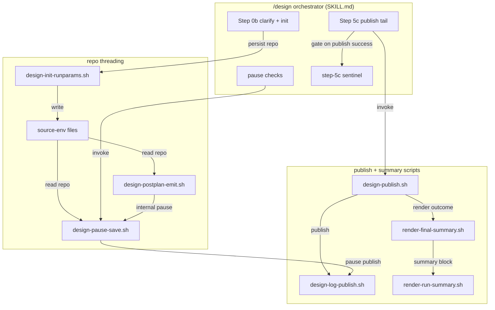

## Architecture Diagram

```mermaid
graph TD
    subgraph orchestrator["/design orchestrator (SKILL.md)"]
        STEP5C["Step 5c publish tail"]
        STEP0B["Step 0b clarify + init"]
        PAUSECHK["pause checks"]
        SENT["step-5c sentinel"]
    end
    subgraph publish["publish + summary scripts"]
        DP["design-publish.sh"]
        DLP["design-log-publish.sh"]
        RFS["render-final-summary.sh"]
        RRS["render-run-summary.sh"]
    end
    subgraph repo["repo threading"]
        INIT["design-init-runparams.sh"]
        SRCENV["source-env files"]
        POSTPLAN["design-postplan-emit.sh"]
        PAUSE["design-pause-save.sh"]
    end

    STEP5C -->|invoke| DP
    STEP5C -->|gate on publish success| SENT
    DP -->|publish| DLP
    DP -->|render outcome| RFS
    RFS -->|summary block| RRS
    STEP0B -->|persist repo| INIT
    INIT -->|write| SRCENV
    SRCENV -->|read repo| POSTPLAN
    SRCENV -->|read repo| PAUSE
    PAUSECHK -->|invoke| PAUSE
    POSTPLAN -->|internal pause| PAUSE
    PAUSE -->|pause publish| DLP
```
