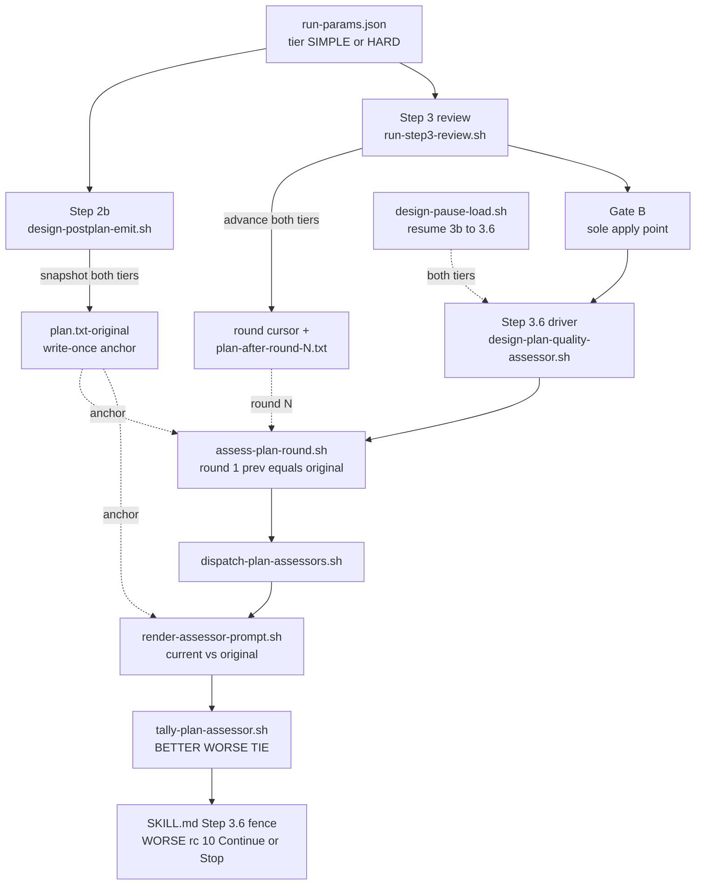

## Architecture Diagram

```mermaid
graph TD
    RP["run-params.json<br/>tier SIMPLE or HARD"]
    PB["Step 2b<br/>design-postplan-emit.sh"]
    ORIG["plan.txt-original<br/>write-once anchor"]
    R3["Step 3 review<br/>run-step3-review.sh"]
    CUR["round cursor +<br/>plan-after-round-N.txt"]
    GB["Gate B<br/>sole apply point"]
    D36["Step 3.6 driver<br/>design-plan-quality-assessor.sh"]
    APR["assess-plan-round.sh<br/>round 1 prev equals original"]
    DISP["dispatch-plan-assessors.sh"]
    REND["render-assessor-prompt.sh<br/>current vs original"]
    TALLY["tally-plan-assessor.sh<br/>BETTER WORSE TIE"]
    GATE["SKILL.md Step 3.6 fence<br/>WORSE rc 10 Continue or Stop"]
    PAUSE["design-pause-load.sh<br/>resume 3b to 3.6"]

    RP --> PB
    PB -->|snapshot both tiers| ORIG
    RP --> R3
    R3 -->|advance both tiers| CUR
    R3 --> GB
    GB --> D36
    D36 --> APR
    APR --> DISP
    DISP --> REND
    REND --> TALLY
    TALLY --> GATE
    ORIG -.->|anchor| APR
    ORIG -.->|anchor| REND
    CUR -.->|round N| APR
    PAUSE -.->|both tiers| D36
```
