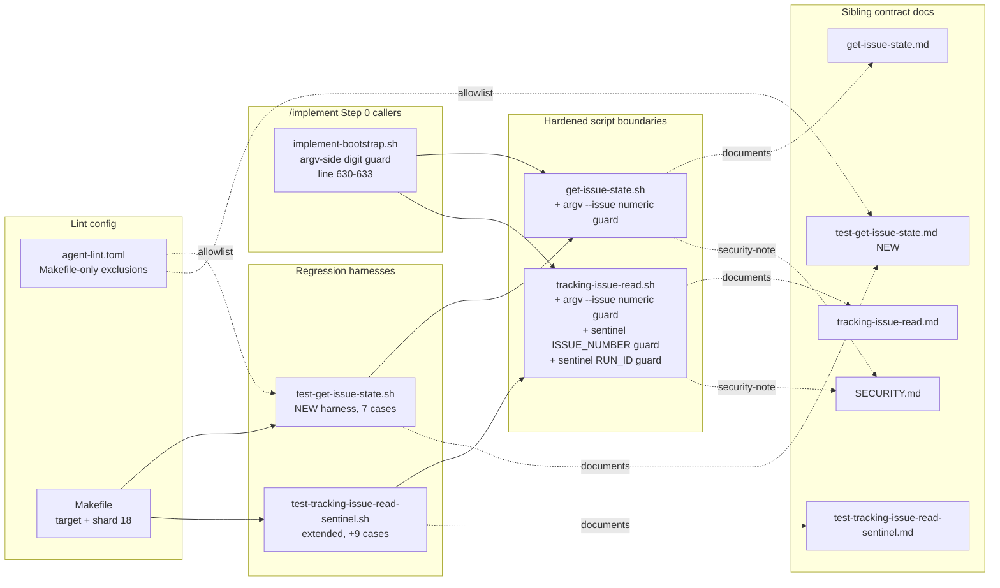

## Architecture Diagram

```mermaid
flowchart LR
    subgraph callers["/implement Step 0 callers"]
        IB["implement-bootstrap.sh<br/>argv-side digit guard<br/>line 630-633"]
    end

    subgraph scripts["Hardened script boundaries"]
        GIS["get-issue-state.sh<br/>+ argv --issue numeric guard"]
        TIR["tracking-issue-read.sh<br/>+ argv --issue numeric guard<br/>+ sentinel ISSUE_NUMBER guard<br/>+ sentinel RUN_ID guard"]
    end

    subgraph harness["Regression harnesses"]
        TGS["test-get-issue-state.sh<br/>NEW harness, 7 cases"]
        TTR["test-tracking-issue-read-sentinel.sh<br/>extended, +9 cases"]
    end

    subgraph docs["Sibling contract docs"]
        GISMD["get-issue-state.md"]
        TIRMD["tracking-issue-read.md"]
        TGSMD["test-get-issue-state.md NEW"]
        TTRMD["test-tracking-issue-read-sentinel.md"]
        SEC["SECURITY.md"]
    end

    subgraph lint["Lint config"]
        AGENT["agent-lint.toml<br/>Makefile-only exclusions"]
        MK["Makefile<br/>target + shard 18"]
    end

    IB --> GIS
    IB --> TIR
    TGS --> GIS
    TTR --> TIR
    GIS -.documents.-> GISMD
    TIR -.documents.-> TIRMD
    TGS -.documents.-> TGSMD
    TTR -.documents.-> TTRMD
    GIS -.security-note.-> SEC
    TIR -.security-note.-> SEC
    MK --> TGS
    MK --> TTR
    AGENT -.allowlist.-> TGS
    AGENT -.allowlist.-> TGSMD
```
