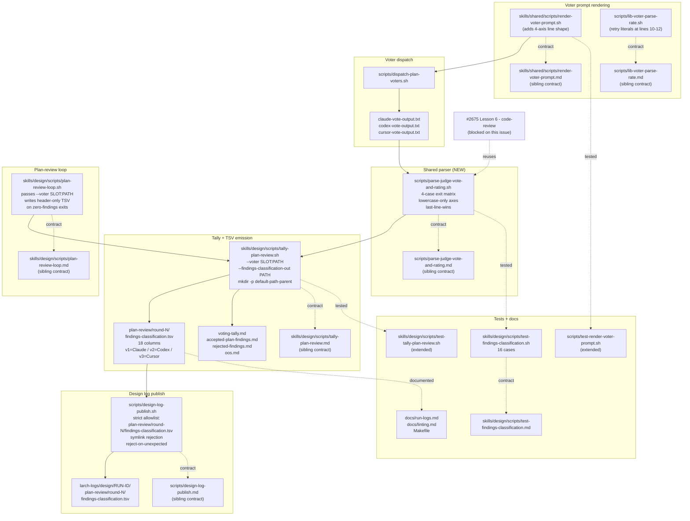

## Architecture Diagram

```mermaid
flowchart TD
    subgraph voter_prompt["Voter prompt rendering"]
        RVP["skills/shared/scripts/render-voter-prompt.sh<br/>(adds 4-axis line shape)"]
        VPM["skills/shared/scripts/render-voter-prompt.md<br/>(sibling contract)"]
        LVR["scripts/lib-voter-parse-rate.sh<br/>(retry literals at lines 10-12)"]
        LVRM["scripts/lib-voter-parse-rate.md<br/>(sibling contract)"]
    end

    subgraph dispatch["Voter dispatch"]
        DPV["scripts/dispatch-plan-voters.sh"]
        VC["claude-vote-output.txt<br/>codex-vote-output.txt<br/>cursor-vote-output.txt"]
    end

    subgraph parse["Shared parser (NEW)"]
        PJVR["scripts/parse-judge-vote-and-rating.sh<br/>4-case exit matrix<br/>lowercase-only axes<br/>last-line-wins"]
        PJVRM["scripts/parse-judge-vote-and-rating.md<br/>(sibling contract)"]
    end

    subgraph tally["Tally + TSV emission"]
        TPR["skills/design/scripts/tally-plan-review.sh<br/>--voter SLOT:PATH<br/>--findings-classification-out PATH<br/>mkdir -p default-path-parent"]
        TPRM["skills/design/scripts/tally-plan-review.md<br/>(sibling contract)"]
        TSV["plan-review/round-N/<br/>findings-classification.tsv<br/>18 columns<br/>v1=Claude / v2=Codex / v3=Cursor"]
        VTMD["voting-tally.md<br/>accepted-plan-findings.md<br/>rejected-findings.md<br/>oos.md"]
    end

    subgraph loop["Plan-review loop"]
        PRL["skills/design/scripts/plan-review-loop.sh<br/>passes --voter SLOT:PATH<br/>writes header-only TSV<br/>on zero-findings exits"]
        PRLM["skills/design/scripts/plan-review-loop.md<br/>(sibling contract)"]
    end

    subgraph publish["Design log publish"]
        DLP["scripts/design-log-publish.sh<br/>strict allowlist:<br/>plan-review/round-N/findings-classification.tsv<br/>symlink rejection<br/>reject-on-unexpected"]
        DLPM["scripts/design-log-publish.md<br/>(sibling contract)"]
        OUT["larch-logs/design/RUN-ID/<br/>plan-review/round-N/<br/>findings-classification.tsv"]
    end

    subgraph harnesses["Tests + docs"]
        TFC["skills/design/scripts/test-findings-classification.sh<br/>16 cases"]
        TFCM["skills/design/scripts/test-findings-classification.md"]
        TTPR["skills/design/scripts/test-tally-plan-review.sh<br/>(extended)"]
        TRVP["scripts/test-render-voter-prompt.sh<br/>(extended)"]
        DRL["docs/run-logs.md<br/>docs/linting.md<br/>Makefile"]
    end

    RVP --> DPV
    DPV --> VC
    VC --> PJVR
    PJVR --> TPR
    PRL --> TPR
    TPR --> TSV
    TPR --> VTMD
    TSV --> DLP
    DLP --> OUT

    RVP -.contract.-> VPM
    LVR -.contract.-> LVRM
    PJVR -.contract.-> PJVRM
    TPR -.contract.-> TPRM
    PRL -.contract.-> PRLM
    DLP -.contract.-> DLPM

    PJVR -.tested.-> TFC
    TFC -.contract.-> TFCM
    TPR -.tested.-> TTPR
    RVP -.tested.-> TRVP
    TSV -.documented.-> DRL

    L6["#2675 Lesson 6 - code-review<br/>(blocked on this issue)"] -.reuses.-> PJVR
```
