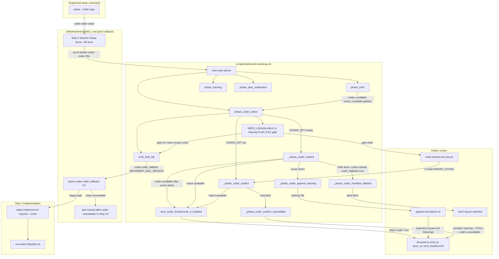

## Architecture Diagram

```mermaid
flowchart TD
    subgraph Slash["/implement slash command"]
        Argv[parse --coder argv]
    end

    subgraph Skill["skills/implement/SKILL.md (post-collapse)"]
        Skill0[Step 0 Session Setup fence ~80 lines]
        Skill0KV[parse coder coder_fallback KV]
        SkillBail[bail routing table coder-unavailable to Step 18]
    end

    subgraph Boot["scripts/implement-bootstrap.sh"]
        Main[main argv parser]
        PhaseInfra[phase_infra]
        PhaseTracking[phase_tracking]
        PhasePlan[phase_plan_materialize]
        PhaseCoder[phase_coder_select]
        PhaseCoderGate[REPO_UNAVAILABLE or missing PLAN_FILE gate]
        Explicit[_phase_coder_explicit]
        Implicit[_phase_coder_implicit]
        Unavail[_phase_coder_explicit_unavailable]
        WarnHelper[_phase_coder_append_warning]
        ManifestHelper[_phase_coder_manifest_fallback]
        BreadcrumbHelper[emit_coder_breadcrumb_if_enabled]
        FinalTail[emit_final_tail]
    end

    subgraph Helpers["Helper scripts"]
        ReadKey[read-session-env-key.sh]
        AppendTool[append-tool-failure.sh]
        LarchLog[larch-log.sh manifest]
        LibQuiet[lib-quiet.sh emit_kv larch_err emit_breadcrumb]
    end

    subgraph Step2["Step 2 implementation"]
        Step2Disp[step2-implement.sh requires --coder]
        Step2Run[run-step2-dispatch.sh]
    end

    Argv -->|coder slash value| Skill0
    Skill0 -->|--up-to-phase coder --coder VAL| Main
    Main --> PhaseInfra
    PhaseInfra -->|codex_available cursor_available globals| PhaseCoder
    Main --> PhaseTracking
    Main --> PhasePlan
    Main --> PhaseCoder

    PhaseCoder --> PhaseCoderGate
    PhaseCoderGate -->|gate hit: return empty coder| FinalTail
    PhaseCoderGate -->|gate clear| ReadKey
    ReadKey -->|tri-state BINARY_FOUND| Explicit
    PhaseCoder -->|CODER_OPT set| Explicit
    PhaseCoder -->|CODER_OPT empty| Implicit

    Explicit -->|match available| BreadcrumbHelper
    Explicit -->|mismatch| Unavail
    Unavail -->|verbatim warning + STALL + coder-unavailable| LibQuiet

    Implicit -->|cursor available| BreadcrumbHelper
    Implicit -->|cursor down| WarnHelper
    Implicit -->|codex available after cursor down| BreadcrumbHelper
    Implicit -->|both down: coder=claude coder_fallback=true| ManifestHelper
    ManifestHelper -->|best-effort| LarchLog
    WarnHelper -->|mktemp file| AppendTool
    AppendTool -->|execution-issues.md Warnings| LibQuiet

    BreadcrumbHelper -->|step0 coder= line| LibQuiet
    PhaseCoder --> FinalTail
    FinalTail -->|coder coder_fallback IMPLEMENT_BAIL_REASON| Skill0KV

    Skill0KV -->|coder-unavailable| SkillBail
    Skill0KV -->|happy path| Step2Disp
    Step2Disp --> Step2Run
```
