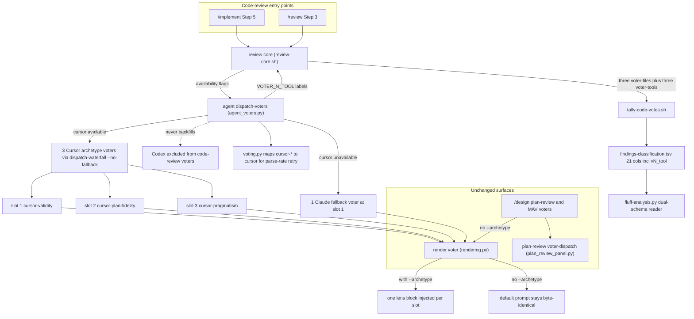

## Architecture Diagram

```mermaid
graph TD
    subgraph Entry["Code-review entry points"]
        IMP["/implement Step 5"]
        REV["/review Step 3"]
    end

    IMP --> RC["review core (review-core.sh)"]
    REV --> RC

    RC -->|"availability flags"| DV["agent dispatch-voters (agent_voters.py)"]

    DV -->|"cursor available"| CUR["3 Cursor archetype voters via dispatch-waterfall --no-fallback"]
    DV -->|"cursor unavailable"| CLF["1 Claude fallback voter at slot 1"]
    DV -.->|"never backfills"| CDX["Codex excluded from code-review voters"]

    CUR --> V1["slot 1 cursor-validity"]
    CUR --> V2["slot 2 cursor-plan-fidelity"]
    CUR --> V3["slot 3 cursor-pragmatism"]

    V1 --> RV["render voter (rendering.py)"]
    V2 --> RV
    V3 --> RV
    CLF --> RV
    RV -->|"with --archetype"| LENS["one lens block injected per slot"]
    RV -->|"no --archetype"| DEF["default prompt stays byte-identical"]

    DV --> NORM["voting.py maps cursor-* to cursor for parse-rate retry"]

    DV -->|"VOTER_N_TOOL labels"| RC
    RC -->|"three voter-files plus three voter-tools"| TALLY["tally-code-votes.sh"]
    TALLY --> TSV["findings-classification.tsv 21 cols incl vN_tool"]
    TSV --> FLUFF["fluff-analysis.py dual-schema reader"]

    subgraph Unchanged["Unchanged surfaces"]
        DSN["/design plan-review and MAV voters"]
        PRP["plan-review voter-dispatch (plan_review_panel.py)"]
        DSN --> PRP
        DSN -->|"no --archetype"| RV
    end
```
