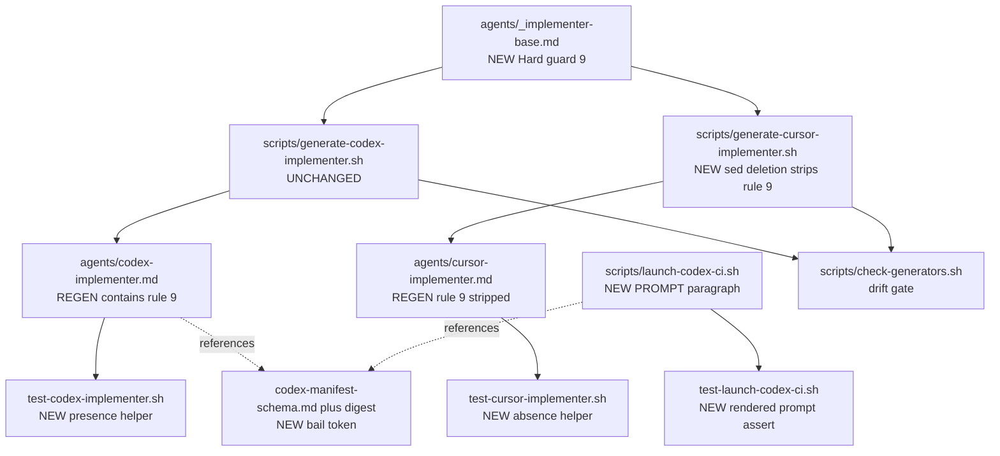

## Architecture Diagram

```mermaid
flowchart TD
    BASE["agents/_implementer-base.md<br/>NEW Hard guard 9"]
    GENCODEX["scripts/generate-codex-implementer.sh<br/>UNCHANGED"]
    GENCURSOR["scripts/generate-cursor-implementer.sh<br/>NEW sed deletion strips rule 9"]
    CODEXART["agents/codex-implementer.md<br/>REGEN contains rule 9"]
    CURSORART["agents/cursor-implementer.md<br/>REGEN rule 9 stripped"]
    CILAUNCH["scripts/launch-codex-ci.sh<br/>NEW PROMPT paragraph"]
    SCHEMA["codex-manifest-schema.md plus digest<br/>NEW bail token"]
    TCODEX["test-codex-implementer.sh<br/>NEW presence helper"]
    TCURSOR["test-cursor-implementer.sh<br/>NEW absence helper"]
    TCI["test-launch-codex-ci.sh<br/>NEW rendered prompt assert"]
    CHECKGEN["scripts/check-generators.sh<br/>drift gate"]
    BASE --> GENCODEX
    BASE --> GENCURSOR
    GENCODEX --> CODEXART
    GENCURSOR --> CURSORART
    CODEXART --> TCODEX
    CURSORART --> TCURSOR
    CILAUNCH --> TCI
    CODEXART -.references.-> SCHEMA
    CILAUNCH -.references.-> SCHEMA
    GENCODEX --> CHECKGEN
    GENCURSOR --> CHECKGEN
```
