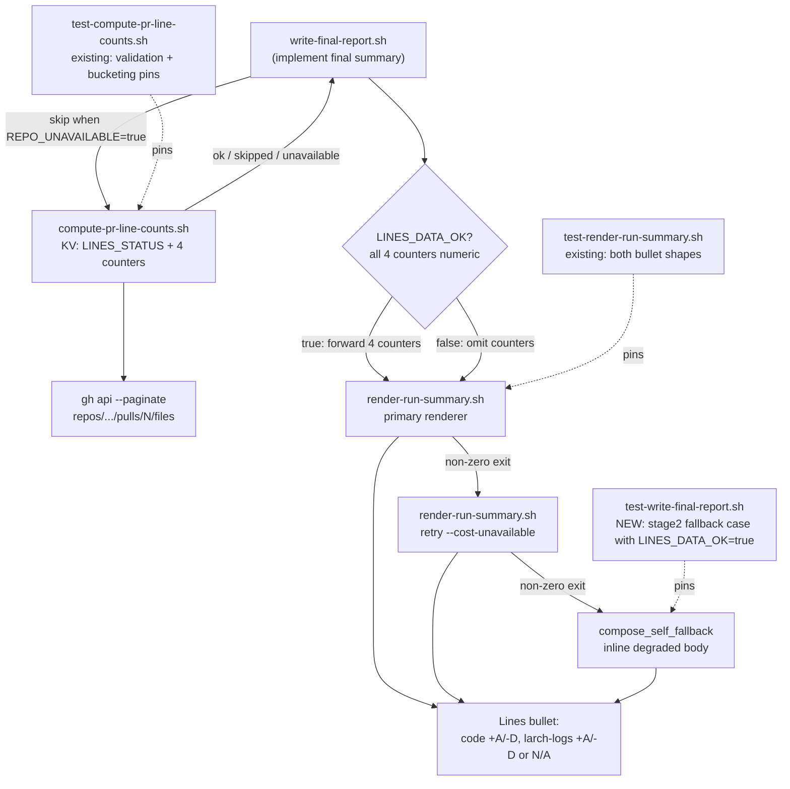

## Architecture Diagram

```mermaid
graph TD
    WFR["write-final-report.sh<br/>(implement final summary)"]
    CPLC["compute-pr-line-counts.sh<br/>KV: LINES_STATUS + 4 counters"]
    GH["gh api --paginate<br/>repos/.../pulls/N/files"]
    GATE{"LINES_DATA_OK?<br/>all 4 counters numeric"}
    RRS["render-run-summary.sh<br/>primary renderer"]
    RETRY["render-run-summary.sh<br/>retry --cost-unavailable"]
    CSF["compose_self_fallback<br/>inline degraded body"]
    BULLET["Lines bullet:<br/>code +A/-D, larch-logs +A/-D or N/A"]

    TWFR["test-write-final-report.sh<br/>NEW: stage2 fallback case with LINES_DATA_OK=true"]
    TCPLC["test-compute-pr-line-counts.sh<br/>existing: validation + bucketing pins"]
    TRRS["test-render-run-summary.sh<br/>existing: both bullet shapes"]

    WFR -->|"skip when REPO_UNAVAILABLE=true"| CPLC
    CPLC --> GH
    CPLC -->|"ok / skipped / unavailable"| WFR
    WFR --> GATE
    GATE -->|"true: forward 4 counters"| RRS
    GATE -->|"false: omit counters"| RRS
    RRS -->|"non-zero exit"| RETRY
    RETRY -->|"non-zero exit"| CSF
    RRS --> BULLET
    RETRY --> BULLET
    CSF --> BULLET

    TWFR -.->|"pins"| CSF
    TCPLC -.->|"pins"| CPLC
    TRRS -.->|"pins"| RRS
```
