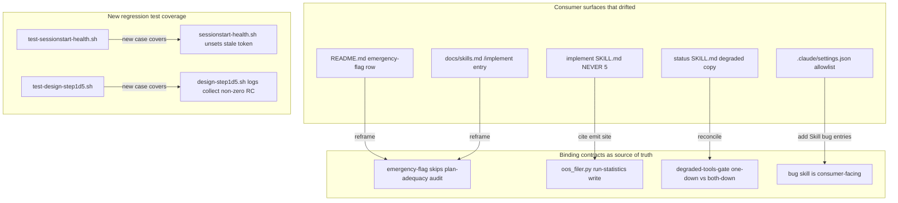

## Architecture Diagram

```mermaid
graph TD
    subgraph consumers["Consumer surfaces that drifted"]
        README["README.md emergency-flag row"]
        SKILLS_DOC["docs/skills.md /implement entry"]
        IMPL_NEVER["implement SKILL.md NEVER 5"]
        STATUS["status SKILL.md degraded copy"]
        SETTINGS[".claude/settings.json allowlist"]
    end

    subgraph contracts["Binding contracts as source of truth"]
        EMERGENCY["emergency-flag skips plan-adequacy audit"]
        OOS_FILER["oos_filer.py run-statistics write"]
        GATE["degraded-tools-gate one-down vs both-down"]
        BUG["bug skill is consumer-facing"]
    end

    subgraph tests["New regression test coverage"]
        SSH_TEST["test-sessionstart-health.sh"]
        SSH_PATH["sessionstart-health.sh unsets stale token"]
        D1D5_TEST["test-design-step1d5.sh"]
        D1D5_PATH["design-step1d5.sh logs collect non-zero RC"]
    end

    README -->|reframe| EMERGENCY
    SKILLS_DOC -->|reframe| EMERGENCY
    IMPL_NEVER -->|cite emit site| OOS_FILER
    STATUS -->|reconcile| GATE
    SETTINGS -->|add Skill bug entries| BUG
    SSH_TEST -->|new case covers| SSH_PATH
    D1D5_TEST -->|new case covers| D1D5_PATH
```
