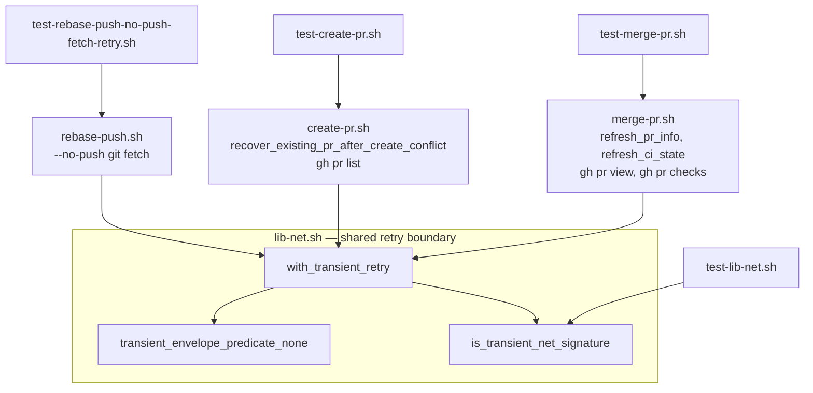

## Architecture Diagram

```mermaid
graph TD
    subgraph libnet["lib-net.sh — shared retry boundary"]
        WTR["with_transient_retry"]
        SIG["is_transient_net_signature"]
        PRED["transient_envelope_predicate_none"]
    end
    RP["rebase-push.sh<br/>--no-push git fetch"]
    CP["create-pr.sh<br/>recover_existing_pr_after_create_conflict<br/>gh pr list"]
    MP["merge-pr.sh<br/>refresh_pr_info, refresh_ci_state<br/>gh pr view, gh pr checks"]
    RP --> WTR
    CP --> WTR
    MP --> WTR
    WTR --> PRED
    WTR --> SIG
    TRP["test-rebase-push-no-push-fetch-retry.sh"] --> RP
    TCP["test-create-pr.sh"] --> CP
    TMP["test-merge-pr.sh"] --> MP
    TLN["test-lib-net.sh"] --> SIG
```
