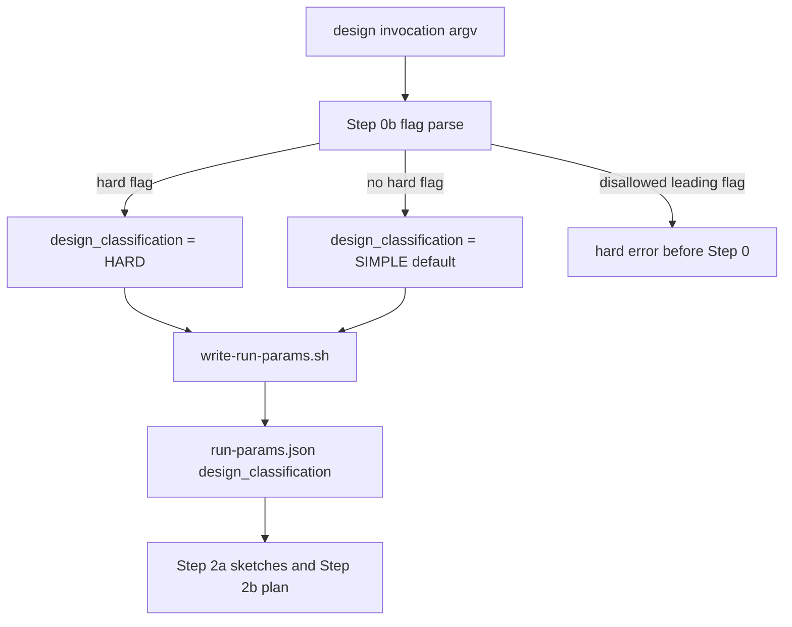

## Architecture Diagram

```mermaid
flowchart TD
    ARGV["design invocation argv"] --> PARSE["Step 0b flag parse"]
    PARSE -->|"hard flag"| HARD["design_classification = HARD"]
    PARSE -->|"no hard flag"| SIMPLE["design_classification = SIMPLE default"]
    PARSE -->|"disallowed leading flag"| REJECT["hard error before Step 0"]
    HARD --> WRP["write-run-params.sh"]
    SIMPLE --> WRP
    WRP --> RPJ["run-params.json design_classification"]
    RPJ --> DOWN["Step 2a sketches and Step 2b plan"]
```
