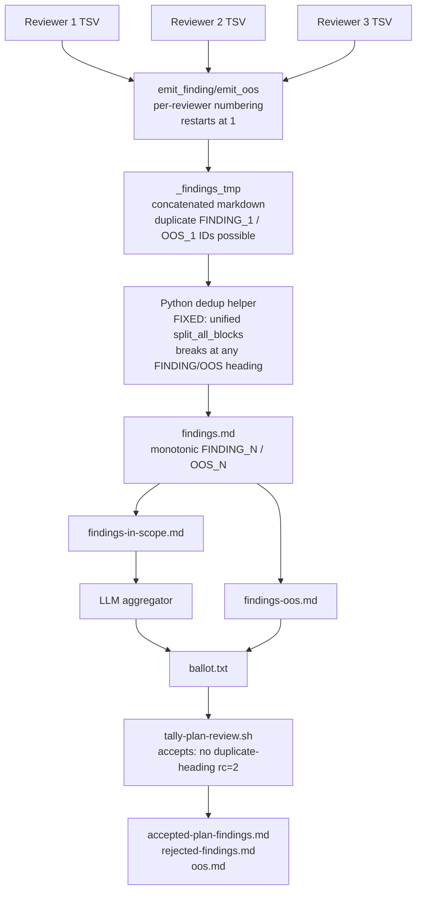

## Architecture Diagram

```mermaid
flowchart TD
    R1[Reviewer 1 TSV] --> EMIT
    R2[Reviewer 2 TSV] --> EMIT
    R3[Reviewer 3 TSV] --> EMIT
    EMIT[emit_finding/emit_oos<br/>per-reviewer numbering<br/>restarts at 1]
    EMIT --> TMP[_findings_tmp<br/>concatenated markdown<br/>duplicate FINDING_1 / OOS_1 IDs possible]
    TMP --> DEDUP[Python dedup helper<br/>FIXED: unified split_all_blocks<br/>breaks at any FINDING/OOS heading]
    DEDUP --> FIND[findings.md<br/>monotonic FINDING_N / OOS_N]
    FIND --> INSCOPE[findings-in-scope.md]
    FIND --> OOSFILE[findings-oos.md]
    INSCOPE --> AGG[LLM aggregator]
    AGG --> BALLOT[ballot.txt]
    OOSFILE --> BALLOT
    BALLOT --> TALLY[tally-plan-review.sh<br/>accepts: no duplicate-heading rc=2]
    TALLY --> ART[accepted-plan-findings.md<br/>rejected-findings.md<br/>oos.md]
```
