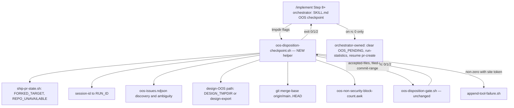

## Architecture Diagram

```mermaid
graph TD
    ORCH["/implement Step 8+ orchestrator: SKILL.md OOS checkpoint"]
    CHK["oos-disposition-checkpoint.sh — NEW helper"]
    GATE["oos-disposition-gate.sh — unchanged"]
    AWK["oos-non-security-block-count.awk"]
    ATF["append-tool-failure.sh"]
    STATE["ship-pr-state.sh: FORKED_TARGET, REPO_UNAVAILABLE"]
    SID["session-id to RUN_ID"]
    NDJSON["oos-issues.ndjson discovery and ambiguity"]
    DESIGN["design-OOS path: DESIGN_TMPDIR or design-export"]
    GIT["git merge-base origin/main..HEAD"]
    CLEAR["orchestrator-owned: clear OOS_PENDING, run-statistics, resume pr-create"]

    ORCH -->|tmpdir flags| CHK
    CHK --> STATE
    CHK --> SID
    CHK --> NDJSON
    CHK --> DESIGN
    CHK --> GIT
    CHK --> AWK
    CHK -->|accepted-files, filed-urls, commit-range| GATE
    GATE -->|rc 0/1/2| CHK
    CHK -->|non-zero with site token| ATF
    CHK -->|exit 0/1/2| ORCH
    ORCH -->|on rc 0 only| CLEAR
```
