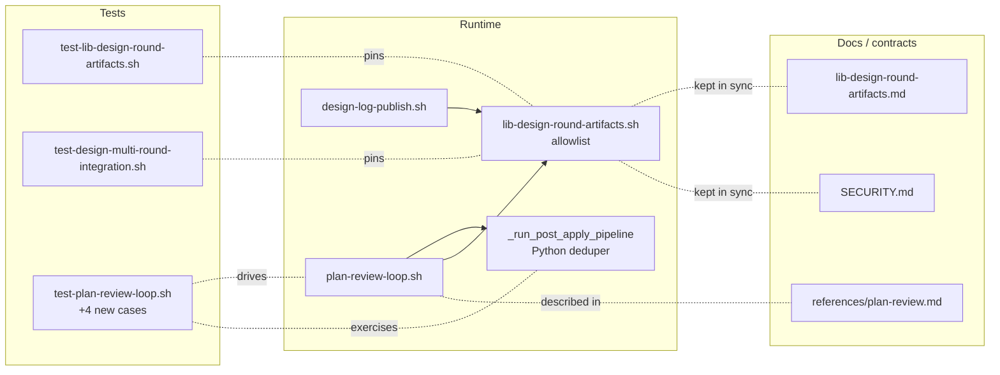

## Architecture Diagram

```mermaid
flowchart LR
    subgraph runtime["Runtime"]
        L["plan-review-loop.sh"]
        D["_run_post_apply_pipeline<br/>Python deduper"]
        A["lib-design-round-artifacts.sh<br/>allowlist"]
        P["design-log-publish.sh"]
        L --> D
        L --> A
        P --> A
    end
    subgraph docs["Docs / contracts"]
        AM["lib-design-round-artifacts.md"]
        PRM["references/plan-review.md"]
        SEC["SECURITY.md"]
    end
    A -.kept in sync.- AM
    A -.kept in sync.- SEC
    L -.described in.- PRM
    subgraph tests["Tests"]
        TA["test-lib-design-round-artifacts.sh"]
        TI["test-design-multi-round-integration.sh"]
        TP["test-plan-review-loop.sh<br/>+4 new cases"]
    end
    TA -.pins.- A
    TI -.pins.- A
    TP -.drives.- L
    TP -.exercises.- D
```
