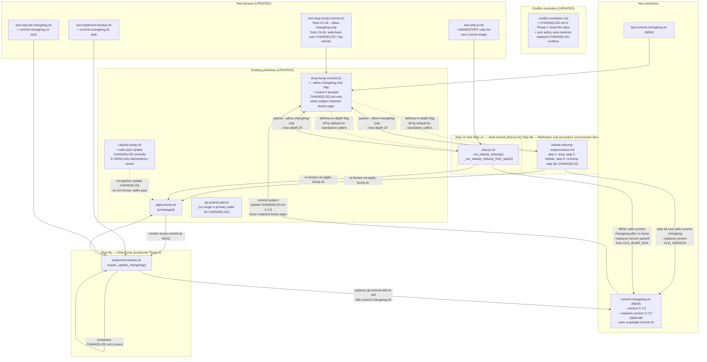

## Architecture Diagram

```mermaid
flowchart TB
    subgraph "Existing primitives (UPDATED)"
        DBC["drop-bump-commit.sh<br/>+ --allow-changelog-only flag<br/>+ Guard 4 accepts CHANGELOG.md-only<br/>when subject matches bump regex"]
        AB["apply-bump.sh<br/>(unchanged)"]
        CB["classify-bump.sh<br/>+ walk past Update CHANGELOG commits<br/>in HEAD-only idempotency check"]
        GAA["git-amend-add.sh<br/>(no longer a primary caller for CHANGELOG)"]
    end

    subgraph "New primitives"
        CC["commit-changelog.sh (NEW)<br/>--version X.Y.Z<br/>--replaces-version X.Y.Z (optional)<br/>uses scripts/git-commit.sh"]
        TCC["test-commit-changelog.sh (NEW)"]
    end

    subgraph "Step 8a — initial bump (postbump Phase 2)"
        IF["implement-finalize.sh<br/>maybe_update_changelog()"]
        IF --> AB
        AB -->|"creates bump commit at HEAD"| IF
        IF -->|"composes CHANGELOG.md content"| IF
        IF -->|"replaces git-amend-add.sh call<br/>with commit-changelog.sh"| CC
    end

    subgraph "Step 8b — Markdown sub-procedure (orchestrator-driven)"
        RRM["rebase-rebump-subprocedure.md<br/>step 1: drop, step 2: rebase, step 4: re-bump, step 4a: CHANGELOG"]
        RRM -->|"passes --allow-changelog-only<br/>--max-depth 20"| DBC
        RRM -->|"re-bumps via apply-bump.sh"| AB
        RRM -->|"step 4a now calls commit-changelog<br/>--replaces-version OLD_VERSION"| CC
    end

    subgraph "Step 10 and Step 12 — shell-owned (ship-pr.sh)"
        SP["ship-pr.sh<br/>run_rebase_rebump()<br/>_run_rebase_rebump_from_step3()"]
        SP -->|"passes --allow-changelog-only<br/>--max-depth 20"| DBC
        SP -->|"re-bumps via apply-bump.sh"| AB
        SP -->|"NEW: calls commit-changelog after re-bump<br/>--replaces-version parsed from OLD_BUMP_SHA"| CC
    end

    subgraph "Conflict-resolution (UPDATED)"
        CR["conflict-resolution.md<br/>+ CHANGELOG.md in Phase 1 trivial-file class<br/>+ ours policy auto-resolves replayed CHANGELOG conflicts"]
    end

    DBC -.->|"defense-in-depth flag<br/>off by default for standalone callers"| RRM
    DBC -.->|"defense-in-depth flag<br/>off by default for standalone callers"| SP

    CC -->|"commit subject:<br/>Update CHANGELOG for X.Y.Z<br/>never matches bump regex"| DBC
    CB -.->|"recognizes Update CHANGELOG<br/>as non-bump; walks past"| AB

    subgraph "Test harness (UPDATED)"
        TDB["test-drop-bump-commit.sh<br/>Tests 21-24: --allow-changelog-only<br/>Tests 25-26: walk-back over CHANGELOG / log-refresh"]
        TIF["test-implement-finalize.sh<br/>+ commit-changelog.sh stub"]
        T8A["test-step-8a-changelog.sh<br/>+ commit-changelog.sh stub"]
        TSP["test-ship-pr.sh<br/>+ MANDATORY case for new commit shape"]
        TCC --> DBC
        TDB --> DBC
        TIF --> IF
        T8A --> IF
        TSP --> SP
    end
```
