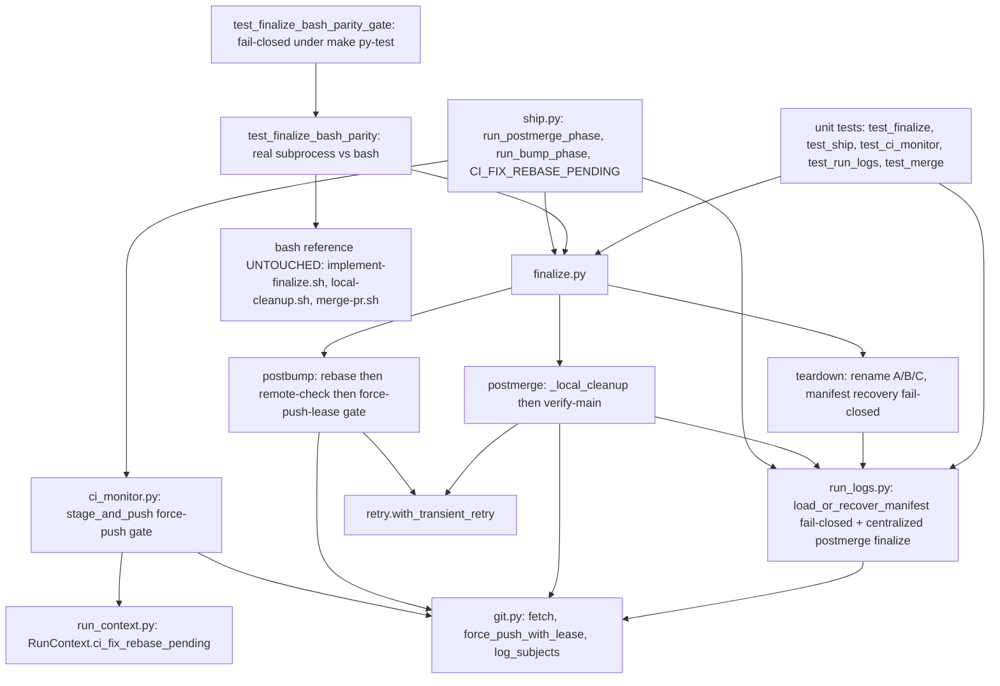

## Architecture Diagram

```mermaid
graph TD
    ship["ship.py: run_postmerge_phase, run_bump_phase, CI_FIX_REBASE_PENDING"]
    ci["ci_monitor.py: stage_and_push force-push gate"]
    rc["run_context.py: RunContext.ci_fix_rebase_pending"]
    fin["finalize.py"]
    pb["postbump: rebase then remote-check then force-push-lease gate"]
    pm["postmerge: _local_cleanup then verify-main"]
    td["teardown: rename A/B/C, manifest recovery fail-closed"]
    rl["run_logs.py: load_or_recover_manifest fail-closed + centralized postmerge finalize"]
    git["git.py: fetch, force_push_with_lease, log_subjects"]
    retry["retry.with_transient_retry"]
    bashref["bash reference UNTOUCHED: implement-finalize.sh, local-cleanup.sh, merge-pr.sh"]
    parity["test_finalize_bash_parity: real subprocess vs bash"]
    gate["test_finalize_bash_parity_gate: fail-closed under make py-test"]
    units["unit tests: test_finalize, test_ship, test_ci_monitor, test_run_logs, test_merge"]

    ship --> fin
    ship --> rl
    ship --> ci
    ci --> rc
    ci --> git
    fin --> pb
    fin --> pm
    fin --> td
    pb --> git
    pb --> retry
    pm --> git
    pm --> retry
    pm --> rl
    td --> rl
    rl --> git
    parity --> bashref
    parity --> fin
    gate --> parity
    units --> fin
    units --> rl
```
