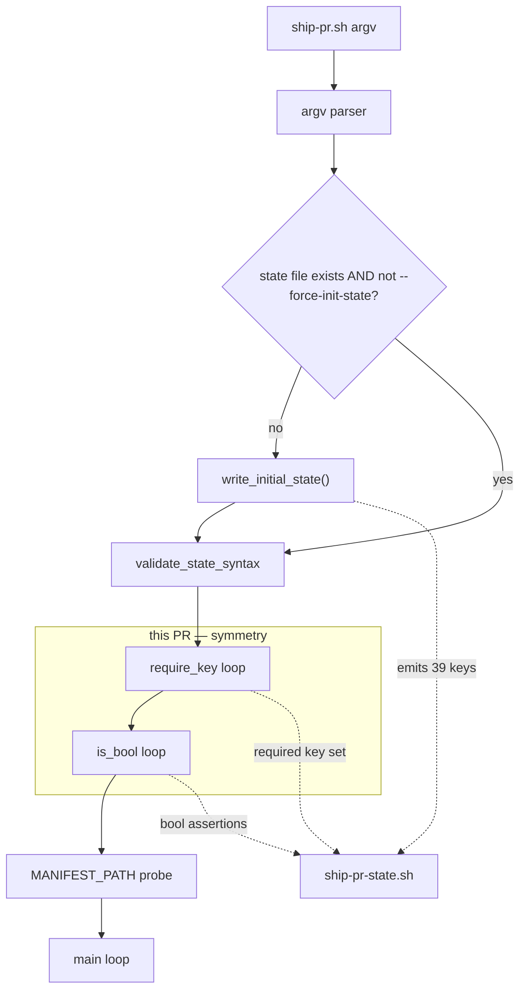

## Architecture Diagram

```mermaid
flowchart TD
    A["ship-pr.sh argv"] --> B["argv parser"]
    B --> C{"state file exists AND not --force-init-state?"}
    C -- "no" --> D["write_initial_state()"]
    C -- "yes" --> E["validate_state_syntax"]
    D --> E
    E --> F["require_key loop"]
    F --> G["is_bool loop"]
    G --> H["MANIFEST_PATH probe"]
    H --> I["main loop"]

    D -.emits 39 keys.-> S["ship-pr-state.sh"]
    F -.required key set.-> S
    G -.bool assertions.-> S

    subgraph "this PR — symmetry"
      F
      G
    end
```
