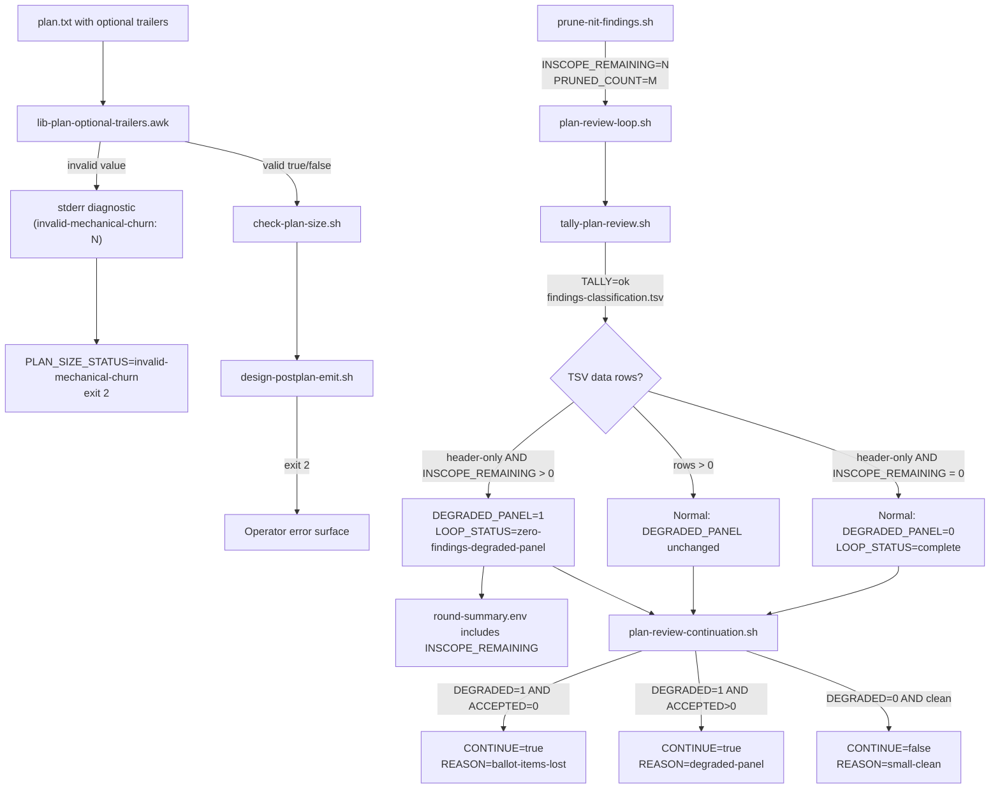

## Architecture Diagram

```mermaid
flowchart TD
    A[plan.txt with optional trailers] --> B[lib-plan-optional-trailers.awk]
    B -->|valid true/false| C[check-plan-size.sh]
    B -->|invalid value| D["stderr diagnostic\n(invalid-mechanical-churn: N)"]
    D --> E["PLAN_SIZE_STATUS=invalid-mechanical-churn\nexit 2"]
    C --> F[design-postplan-emit.sh]
    F -->|exit 2| G[Operator error surface]

    H[prune-nit-findings.sh] -->|INSCOPE_REMAINING=N\nPRUNED_COUNT=M| I[plan-review-loop.sh]
    I --> J[tally-plan-review.sh]
    J -->|TALLY=ok\nfindings-classification.tsv| K{TSV data rows?}
    K -->|rows > 0| L[Normal: DEGRADED_PANEL unchanged]
    K -->|header-only AND INSCOPE_REMAINING > 0| M[DEGRADED_PANEL=1\nLOOP_STATUS=zero-findings-degraded-panel]
    K -->|header-only AND INSCOPE_REMAINING = 0| N[Normal: DEGRADED_PANEL=0\nLOOP_STATUS=complete]
    M --> O[round-summary.env includes INSCOPE_REMAINING]
    M --> P[plan-review-continuation.sh]
    L --> P
    N --> P
    P -->|DEGRADED=1 AND ACCEPTED=0| Q["CONTINUE=true\nREASON=ballot-items-lost"]
    P -->|DEGRADED=1 AND ACCEPTED>0| R["CONTINUE=true\nREASON=degraded-panel"]
    P -->|DEGRADED=0 AND clean| S["CONTINUE=false\nREASON=small-clean"]
```
