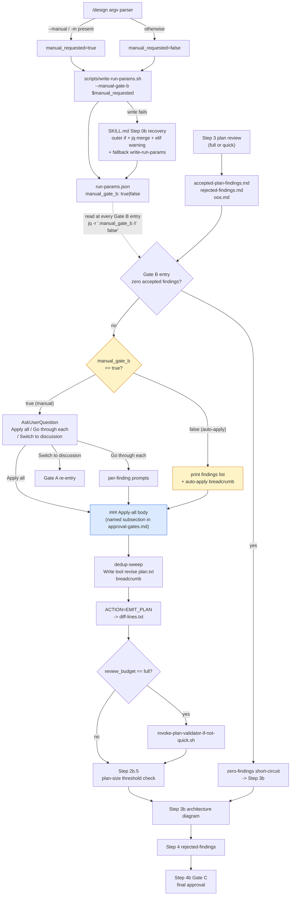

## Architecture Diagram

```mermaid
flowchart TD
    ARGV["/design argv parser"]
    ARGV -->|"--manual / -m present"| SETM["manual_requested=true"]
    ARGV -->|"otherwise"| SETD["manual_requested=false"]
    SETM --> WRP
    SETD --> WRP

    WRP["scripts/write-run-params.sh\n--manual-gate-b $manual_requested"]
    WRP --> RPJ["run-params.json\nmanual_gate_b: true|false"]

    WRP -->|"write fails"| REC["SKILL.md Step 0b recovery\nouter if + jq merge + elif warning\n+ fallback write-run-params"]
    REC --> RPJ

    RPJ -.->|"read at every Gate B entry\njq -r '.manual_gate_b // false'"| GB

    S3["Step 3 plan review\n(full or quick)"]
    S3 --> APF["accepted-plan-findings.md\nrejected-findings.md\noos.md"]
    APF --> GB

    GB{"Gate B entry\nzero accepted findings?"}
    GB -->|"yes"| SC["zero-findings short-circuit\n-> Step 3b"]
    GB -->|"no"| MODE{"manual_gate_b\n== true?"}

    MODE -->|"true (manual)"| ASK["AskUserQuestion\nApply all / Go through each\n/ Switch to discussion"]
    ASK -->|"Apply all"| AAB
    ASK -->|"Go through each"| GTE["per-finding prompts"]
    ASK -->|"Switch to discussion"| GA["Gate A re-entry"]
    GTE --> AAB

    MODE -->|"false (auto-apply)"| AUTO["print findings list\n+ auto-apply breadcrumb"]
    AUTO --> AAB

    AAB["### Apply-all body\n(named subsection in approval-gates.md)"]
    AAB --> DEDUP["dedup-sweep\nWrite tool revise plan.txt\nbreadcrumb"]
    DEDUP --> EMIT["ACTION=EMIT_PLAN\n-> diff-lines.txt"]
    EMIT --> VAL{"review_budget == full?"}
    VAL -->|"yes"| INVOKE["invoke-plan-validator-if-not-quick.sh"]
    VAL -->|"no"| S2B5
    INVOKE --> S2B5["Step 2b.5\nplan-size threshold check"]
    S2B5 --> S3B["Step 3b architecture diagram"]
    SC --> S3B
    S3B --> S4["Step 4 rejected-findings"]
    S4 --> S4B["Step 4b Gate C\nfinal approval"]

    style MODE fill:#fef3c7,stroke:#d97706
    style AAB fill:#dbeafe,stroke:#2563eb
    style AUTO fill:#fef3c7,stroke:#d97706
```
