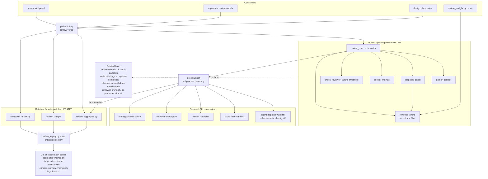

## Architecture Diagram

```mermaid
graph TD
    subgraph Consumers [Consumers]
        REV["review skill panel"]
        IMP["implement review-and-fix"]
        DSN["design plan-review"]
        RAF["review_and_fix.py prune"]
    end

    CLI["python/cli.py<br/>review verbs"]

    subgraph Ported [review_pipeline.py REWRITTEN]
        RC["review_core orchestrator"]
        GC["gather_context"]
        DP["dispatch_panel"]
        CF["collect_findings"]
        CT["check_reviewer_failure_threshold"]
        RP["reviewer_prune<br/>record and filter"]
    end

    subgraph Facades [Retained facade modules UPDATED]
        AGG["review_aggregate.py"]
        TAL["review_tally.py"]
        CMP["compose_review.py"]
    end

    LEG["review_legacy.py NEW<br/>shared shell relay"]
    BASH["Out of scope bash bodies<br/>aggregate-findings.sh<br/>tally-code-votes.sh<br/>emit-tally.sh<br/>compose-review-findings.sh<br/>log-phase.sh"]

    PROC["proc.Runner<br/>subprocess boundary"]

    subgraph Boundaries [Retained CLI boundaries]
        AGT["agent dispatch-waterfall<br/>collect-results, classify-diff"]
        SCT["scout filter-manifest"]
        RND["render specialist"]
        DT["dirty-tree checkpoint"]
        RL["run-log append-failure"]
    end

    DEL["Deleted bash<br/>review-core.sh, dispatch-panel.sh<br/>collect-findings.sh, gather-context.sh<br/>check-reviewer-failure-threshold.sh<br/>reviewer-prune.sh, lib-prune-decision.sh"]

    REV --> CLI
    IMP --> CLI
    DSN --> CLI
    RAF --> RP
    CLI --> RC
    CLI --> AGG
    CLI --> TAL
    CLI --> CMP
    RC --> GC
    RC --> DP
    RC --> CF
    RC --> CT
    RC --> RP
    DP --> RP
    RC --> PROC
    PROC --> AGT
    PROC --> SCT
    PROC --> RND
    PROC --> DT
    PROC --> RL
    PROC -->|facade verbs| AGG
    AGG --> LEG
    TAL --> LEG
    CMP --> LEG
    LEG --> BASH
    Ported -.replaces.-> DEL
```
