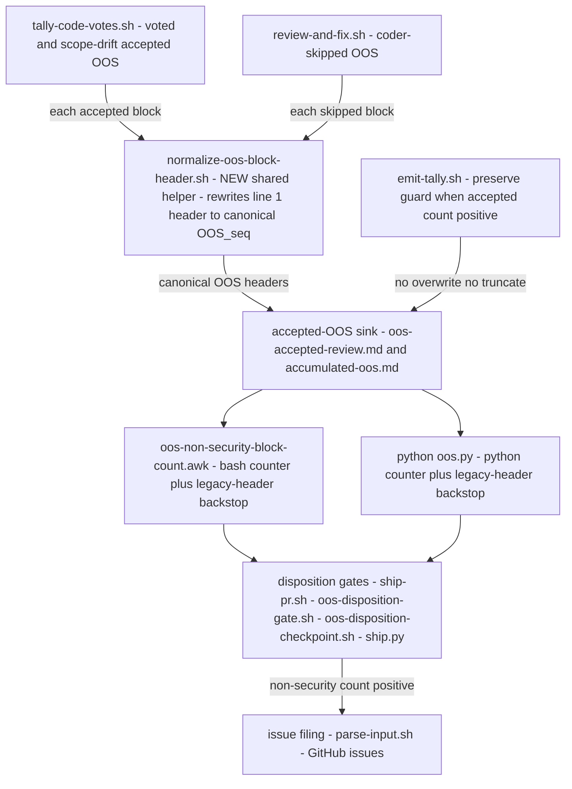

## Architecture Diagram

```mermaid
graph TD
    TCV["tally-code-votes.sh - voted and scope-drift accepted OOS"]
    RAF["review-and-fix.sh - coder-skipped OOS"]
    NORM["normalize-oos-block-header.sh - NEW shared helper - rewrites line 1 header to canonical OOS_seq"]
    EMIT["emit-tally.sh - preserve guard when accepted count positive"]
    SINK["accepted-OOS sink - oos-accepted-review.md and accumulated-oos.md"]
    AWK["oos-non-security-block-count.awk - bash counter plus legacy-header backstop"]
    PY["python oos.py - python counter plus legacy-header backstop"]
    GATE["disposition gates - ship-pr.sh - oos-disposition-gate.sh - oos-disposition-checkpoint.sh - ship.py"]
    FILE["issue filing - parse-input.sh - GitHub issues"]
    TCV -->|each accepted block| NORM
    RAF -->|each skipped block| NORM
    NORM -->|canonical OOS headers| SINK
    EMIT -->|no overwrite no truncate| SINK
    SINK --> AWK
    SINK --> PY
    AWK --> GATE
    PY --> GATE
    GATE -->|non-security count positive| FILE
```
