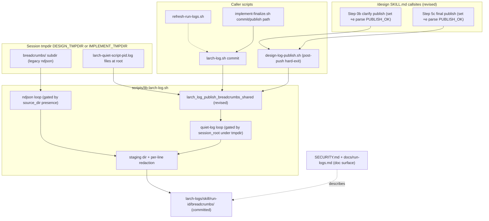

## Architecture Diagram

```mermaid
flowchart TD
    subgraph Session["Session tmpdir DESIGN_TMPDIR or IMPLEMENT_TMPDIR"]
        Q1["larch-quiet-script-pid.log files at root"]
        BC["breadcrumbs/ subdir (legacy ndjson)"]
    end

    subgraph Lib["scripts/lib-larch-log.sh"]
        H["larch_log_publish_breadcrumbs_shared (revised)"]
        NDJ["ndjson loop (gated by source_dir presence)"]
        QL["quiet-log loop (gated by session_root under tmpdir)"]
        Stage["staging dir + per-line redaction"]
    end

    subgraph CallSite["Caller scripts"]
        LCS["larch-log.sh commit"]
        DLP["design-log-publish.sh (post-push hard-exit)"]
        RRL["refresh-run-logs.sh"]
        IFN["implement-finalize.sh commit/publish path"]
    end

    Repo["larch-logs/skill/run-id/breadcrumbs/ (committed)"]

    Q1 --> H
    BC --> NDJ
    NDJ --> Stage
    H --> QL
    QL --> Stage
    Stage --> Repo

    LCS --> H
    DLP --> H
    RRL -.-> LCS
    IFN --> LCS

    subgraph SKILL["/design SKILL.md callsites (revised)"]
        S1["Step 0b clarify publish (set +e parse PUBLISH_OK)"]
        S2["Step 5c final publish (set +e parse PUBLISH_OK)"]
    end
    S1 --> DLP
    S2 --> DLP

    Sec["SECURITY.md + docs/run-logs.md (doc surface)"]
    Sec -.->|describes| Repo
```
