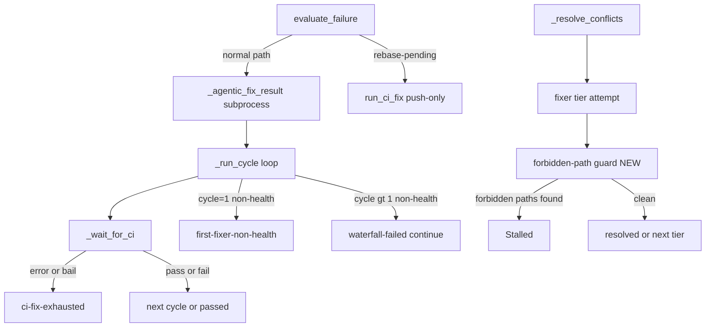

## Architecture Diagram

```mermaid
flowchart TD
    EF["evaluate_failure"]
    AF["_agentic_fix_result subprocess"]
    RC["run_ci_fix push-only"]
    CY["_run_cycle loop"]
    WC["_wait_for_ci"]

    EF -->|"normal path"| AF
    EF -->|"rebase-pending"| RC

    AF --> CY

    CY -->|"cycle=1 non-health"| FNH["first-fixer-non-health"]
    CY -->|"cycle gt 1 non-health"| WF["waterfall-failed continue"]
    CY --> WC

    WC -->|"error or bail"| CE["ci-fix-exhausted"]
    WC -->|"pass or fail"| NEXT["next cycle or passed"]

    RS["_resolve_conflicts"]
    FT["fixer tier attempt"]
    FG["forbidden-path guard NEW"]
    ST["Stalled"]

    RS --> FT
    FT --> FG
    FG -->|"forbidden paths found"| ST
    FG -->|"clean"| RES["resolved or next tier"]
```
