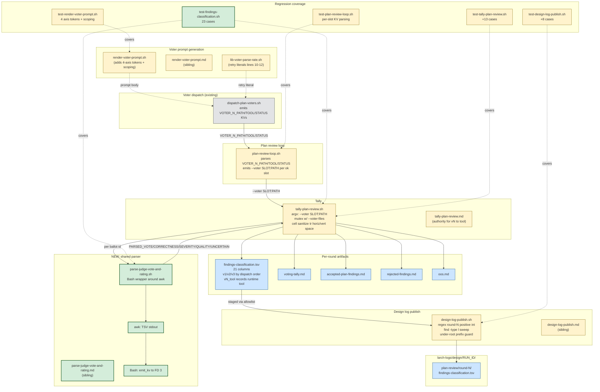

## Architecture Diagram

```mermaid
flowchart TD
    subgraph PromptGen["Voter prompt generation"]
        RVP["render-voter-prompt.sh<br/>(adds 4-axis tokens + scoping)"]
        RVPmd["render-voter-prompt.md<br/>(sibling)"]
        LVPR["lib-voter-parse-rate.sh<br/>(retry literals lines 10-12)"]
    end

    subgraph Dispatch["Voter dispatch (existing)"]
        DPV["dispatch-plan-voters.sh<br/>emits VOTER_N_PATH/TOOL/STATUS KVs"]
    end

    subgraph Loop["Plan review loop"]
        PRL["plan-review-loop.sh<br/>parses VOTER_N_PATH/TOOL/STATUS<br/>emits --voter SLOT:PATH per ok slot"]
    end

    subgraph Parser["NEW: shared parser"]
        PJVR["parse-judge-vote-and-rating.sh<br/>Bash wrapper around awk"]
        PJVRmd["parse-judge-vote-and-rating.md<br/>(sibling)"]
        AWK["awk: TSV stdout"]
        EMIT["Bash: emit_kv to FD 3"]
        PJVR --> AWK
        AWK --> EMIT
    end

    subgraph Tally["Tally"]
        TPR["tally-plan-review.sh<br/>argv: --voter SLOT:PATH<br/>mutex w/ --voter-files<br/>cell sanitize tr horiz/vert space"]
        TPRmd["tally-plan-review.md<br/>(authority for vN to tool)"]
    end

    subgraph TSV["Per-round artifacts"]
        TSV21["findings-classification.tsv<br/>21 columns<br/>v1/v2/v3 by dispatch order<br/>vN_tool records runtime tool"]
        VT["voting-tally.md"]
        APF["accepted-plan-findings.md"]
        RF["rejected-findings.md"]
        OOS["oos.md"]
    end

    subgraph Publish["Design log publish"]
        DLP["design-log-publish.sh<br/>regex round-N positive int<br/>find -type l sweep<br/>under-root prefix guard"]
        DLPmd["design-log-publish.md<br/>(sibling)"]
    end

    subgraph LogBundle["larch-logs/design/RUN_ID/"]
        STAGED["plan-review/round-N/<br/>findings-classification.tsv"]
    end

    subgraph Harness["Regression coverage"]
        TFC["test-findings-classification.sh<br/>23 cases"]
        TTPR["test-tally-plan-review.sh<br/>+13 cases"]
        TDLP["test-design-log-publish.sh<br/>+8 cases"]
        TPRL["test-plan-review-loop.sh<br/>per-slot KV parsing"]
        TRVP["test-render-voter-prompt.sh<br/>4 axis tokens + scoping"]
    end

    RVP -.->|prompt body| DPV
    LVPR -.->|retry literal| DPV
    DPV -->|VOTER_N_PATH/TOOL/STATUS| PRL
    PRL -->|--voter SLOT:PATH| TPR
    TPR -->|per ballot id| PJVR
    PJVR -->|PARSED_VOTE/CORRECTNESS/SEVERITY/QUALITY/UNCERTAIN| TPR
    TPR --> TSV21
    TPR --> VT
    TPR --> APF
    TPR --> RF
    TPR --> OOS
    TSV21 -->|staged via allowlist| DLP
    DLP --> STAGED

    TFC -.->|covers| PJVR
    TFC -.->|covers| TPR
    TTPR -.->|covers| TPR
    TDLP -.->|covers| DLP
    TPRL -.->|covers| PRL
    TRVP -.->|covers| RVP

    classDef new fill:#d4edda,stroke:#155724,stroke-width:2px;
    classDef modified fill:#fff3cd,stroke:#856404,stroke-width:1px;
    classDef artifact fill:#cce5ff,stroke:#004085;
    classDef external fill:#e2e3e5,stroke:#383d41;

    class PJVR,PJVRmd,AWK,EMIT,TFC new;
    class RVP,LVPR,PRL,TPR,TPRmd,DLP,DLPmd,RVPmd,TTPR,TDLP,TPRL,TRVP modified;
    class TSV21,VT,APF,RF,OOS,STAGED artifact;
    class DPV external;
```
