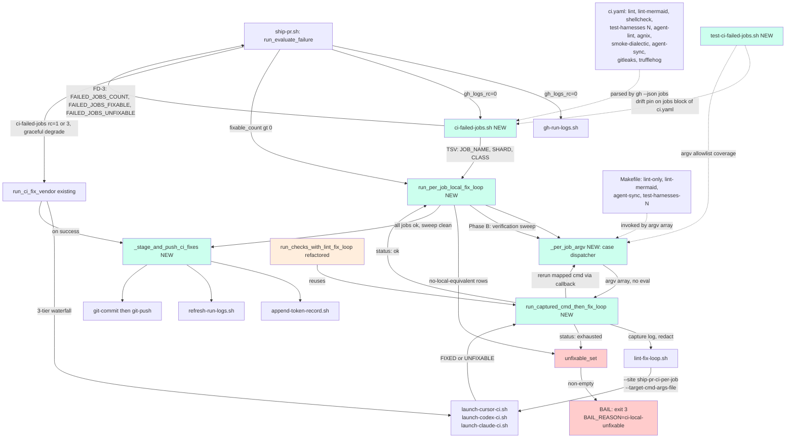

## Architecture Diagram

**Legend**: green = new components introduced by this plan; pink = bail / unfixable-set sink; orange = refactored existing component; solid arrows = control flow; dashed arrows = data references / drift pins / config inputs.
