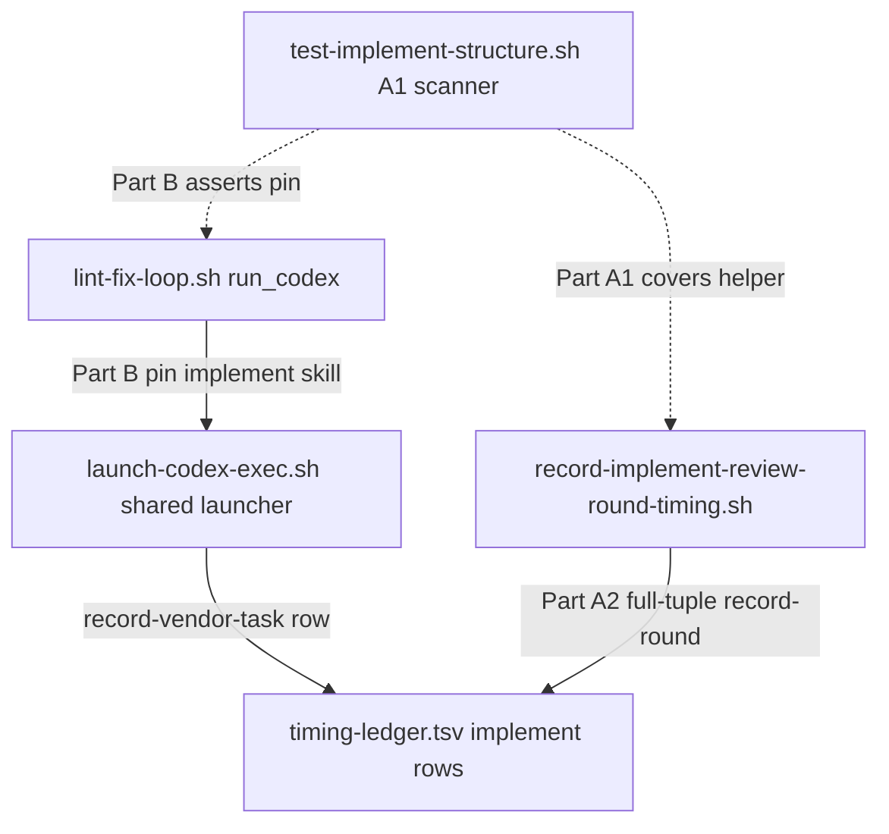

## Architecture Diagram

```mermaid
graph TD
    LFL["lint-fix-loop.sh run_codex"]
    RIRT["record-implement-review-round-timing.sh"]
    LCE["launch-codex-exec.sh shared launcher"]
    TL["timing-ledger.tsv implement rows"]
    SCAN["test-implement-structure.sh A1 scanner"]

    LFL -->|"Part B pin implement skill"| LCE
    LCE -->|"record-vendor-task row"| TL
    RIRT -->|"Part A2 full-tuple record-round"| TL
    SCAN -.->|"Part A1 covers helper"| RIRT
    SCAN -.->|"Part B asserts pin"| LFL
```
