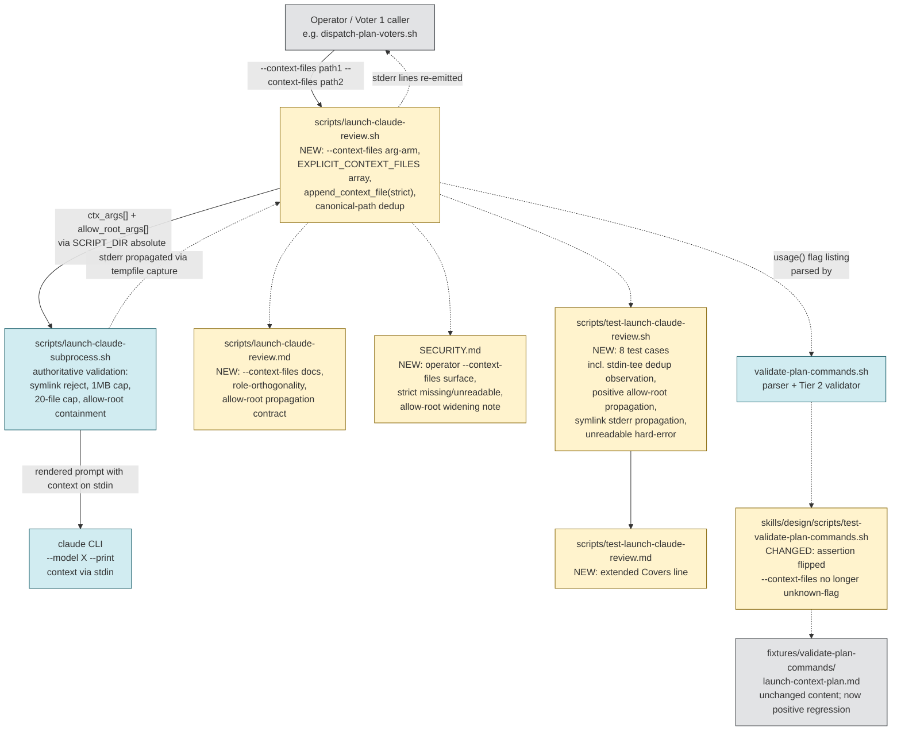

## Architecture Diagram

```mermaid
graph TD
    Caller["Operator / Voter 1 caller<br/>e.g. dispatch-plan-voters.sh"]
    Launcher["scripts/launch-claude-review.sh<br/>NEW: --context-files arg-arm,<br/>EXPLICIT_CONTEXT_FILES array,<br/>append_context_file(strict),<br/>canonical-path dedup"]
    Subprocess["scripts/launch-claude-subprocess.sh<br/>authoritative validation:<br/>symlink reject, 1MB cap,<br/>20-file cap, allow-root containment"]
    Claude["claude CLI<br/>--model X --print<br/>context via stdin"]

    LauncherDocs["scripts/launch-claude-review.md<br/>NEW: --context-files docs,<br/>role-orthogonality,<br/>allow-root propagation contract"]
    Security["SECURITY.md<br/>NEW: operator --context-files surface,<br/>strict missing/unreadable,<br/>allow-root widening note"]

    TestHarness["scripts/test-launch-claude-review.sh<br/>NEW: 8 test cases<br/>incl. stdin-tee dedup observation,<br/>positive allow-root propagation,<br/>symlink stderr propagation,<br/>unreadable hard-error"]
    TestHarnessDoc["scripts/test-launch-claude-review.md<br/>NEW: extended Covers line"]

    ValidatorHarness["skills/design/scripts/test-validate-plan-commands.sh<br/>CHANGED: assertion flipped<br/>--context-files no longer unknown-flag"]
    ValidatorFixture["fixtures/validate-plan-commands/<br/>launch-context-plan.md<br/>unchanged content; now positive regression"]
    PlanValidator["validate-plan-commands.sh<br/>parser + Tier 2 validator"]

    Caller -- "--context-files path1 --context-files path2" --> Launcher
    Launcher -- "ctx_args[] + allow_root_args[]<br/>via SCRIPT_DIR absolute path" --> Subprocess
    Subprocess -- "rendered prompt with context on stdin" --> Claude
    Subprocess -. "stderr propagated via tempfile capture" .-> Launcher
    Launcher -. "stderr lines re-emitted" .-> Caller

    Launcher -.-> LauncherDocs
    Launcher -.-> Security
    Launcher -.-> TestHarness
    TestHarness --> TestHarnessDoc
    Launcher -. "usage() flag listing<br/>parsed by" .-> PlanValidator
    PlanValidator -.-> ValidatorHarness
    ValidatorHarness -.-> ValidatorFixture

    classDef changed fill:#fff3cd,stroke:#856404
    classDef contract fill:#d1ecf1,stroke:#0c5460
    classDef unchanged fill:#e2e3e5,stroke:#383d41
    class Launcher,LauncherDocs,Security,TestHarness,TestHarnessDoc,ValidatorHarness changed
    class Subprocess,Claude,PlanValidator contract
    class Caller,ValidatorFixture unchanged
```
