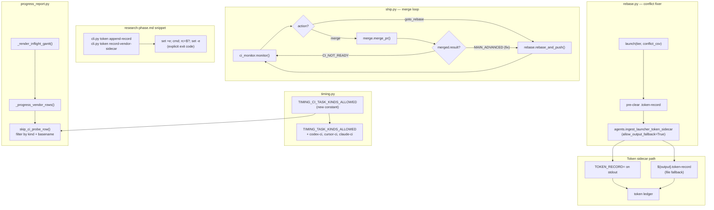

## Architecture Diagram

```mermaid
graph TD
    subgraph "ship.py — merge loop"
        MONITOR["ci_monitor.monitor()"]
        DECIDE{"action?"}
        MERGE["merge.merge_pr()"]
        MERGE_RESULT{"merged.result?"}
        REBASE_BLOCK["rebase.rebase_and_push()"]
    end

    subgraph "rebase.py — conflict fixer"
        CONFLICT_LAUNCH["launch(tier, conflict_csv)"]
        PRE_CLEAR["pre-clear .token-record"]
        INGEST["agents.ingest_launcher_token_sidecar\n(allow_output_fallback=True)"]
    end

    subgraph "Token sidecar path"
        STDOUT_TOKEN["TOKEN_RECORD= on stdout"]
        FILE_TOKEN["${output}.token-record\n(file fallback)"]
        LEDGER["token ledger"]
    end

    subgraph "research-phase.md snippet"
        SIDECAR_CMD["cli.py token append-record\ncli.py token record-vendor-sidecar"]
        RC_CAPTURE["set +e; cmd; rc=$?; set -e\n(explicit exit code)"]
    end

    subgraph "timing.py"
        KINDS["TIMING_TASK_KINDS_ALLOWED\n+ codex-ci, cursor-ci, claude-ci"]
        CI_KINDS["TIMING_CI_TASK_KINDS_ALLOWED\n(new constant)"]
    end

    subgraph "progress_report.py"
        INFLIGHT["_render_inflight_gantt()"]
        VENDOR_ROWS["_progress_vendor_rows()"]
        CI_FILTER["skip_ci_probe_row()\nfilter by kind + basename"]
    end

    MONITOR --> DECIDE
    DECIDE -- "goto_rebase" --> REBASE_BLOCK
    DECIDE -- "merge" --> MERGE
    MERGE --> MERGE_RESULT
    MERGE_RESULT -- "MAIN_ADVANCED (fix)" --> REBASE_BLOCK
    MERGE_RESULT -- "CI_NOT_READY" --> MONITOR
    REBASE_BLOCK --> MONITOR

    CONFLICT_LAUNCH --> PRE_CLEAR
    PRE_CLEAR --> INGEST
    INGEST --> STDOUT_TOKEN
    INGEST --> FILE_TOKEN
    STDOUT_TOKEN --> LEDGER
    FILE_TOKEN --> LEDGER

    SIDECAR_CMD --> RC_CAPTURE

    CI_KINDS --> KINDS
    CI_KINDS --> CI_FILTER

    INFLIGHT --> VENDOR_ROWS
    VENDOR_ROWS --> CI_FILTER
```
