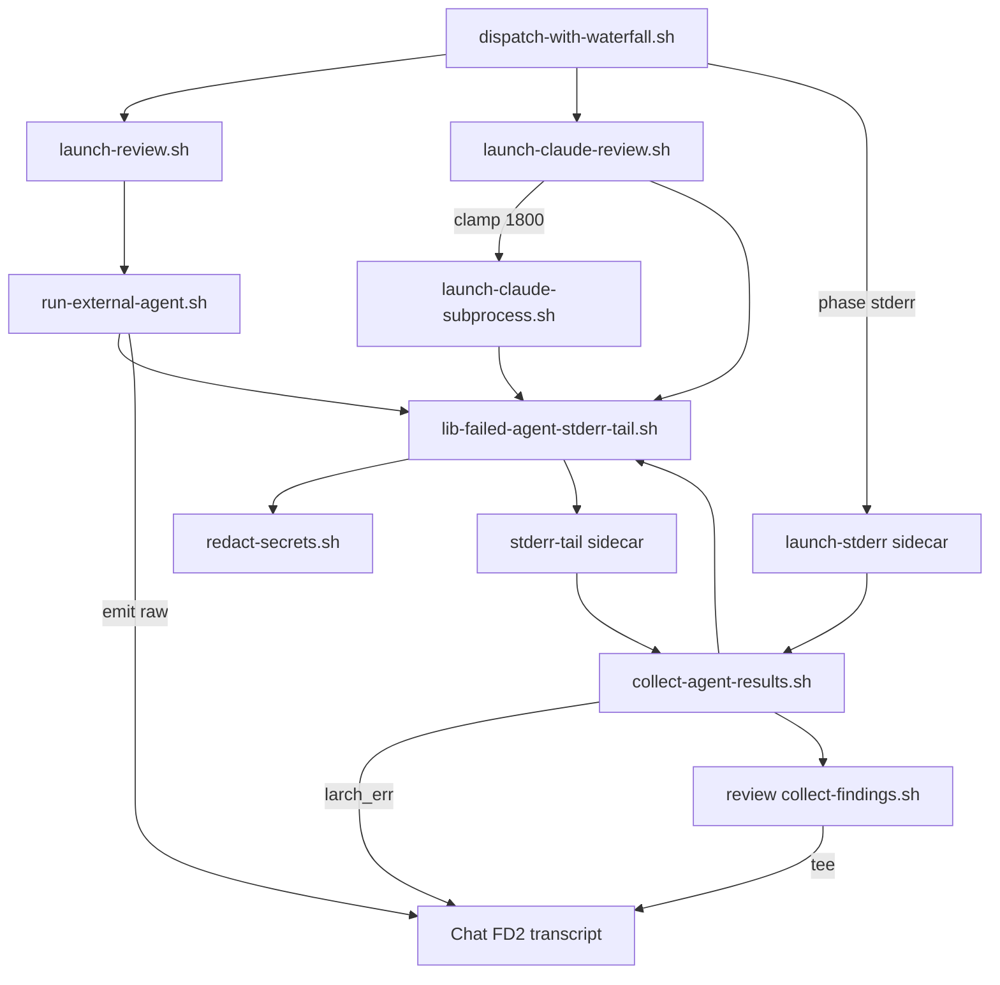

## Architecture Diagram

```mermaid
graph TD
  DWF[dispatch-with-waterfall.sh]
  LR[launch-review.sh]
  LCR[launch-claude-review.sh]
  REA[run-external-agent.sh]
  LCS[launch-claude-subprocess.sh]
  LIB[lib-failed-agent-stderr-tail.sh]
  RED[redact-secrets.sh]
  TAIL[stderr-tail sidecar]
  LST[launch-stderr sidecar]
  COL[collect-agent-results.sh]
  CF[review collect-findings.sh]
  CHAT[Chat FD2 transcript]

  DWF --> LR
  DWF --> LCR
  DWF -->|phase stderr| LST
  LR --> REA
  LCR -->|clamp 1800| LCS
  REA --> LIB
  LCS --> LIB
  LCR --> LIB
  LIB --> RED
  LIB --> TAIL
  REA -->|emit raw| CHAT
  TAIL --> COL
  LST --> COL
  COL --> LIB
  COL -->|larch_err| CHAT
  COL --> CF
  CF -->|tee| CHAT
```
