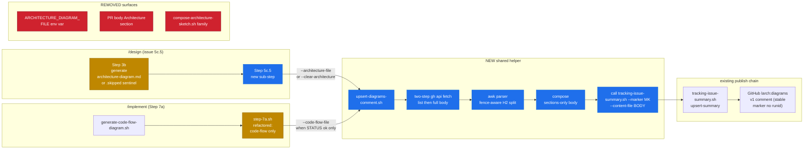

## Architecture Diagram

```mermaid
flowchart LR
    subgraph design["/design (issue 5c.5)"]
        D_3B["Step 3b<br/>generate<br/>architecture-diagram.md<br/>or .skipped sentinel"]
        D_5C5["Step 5c.5<br/>new sub-step"]
        D_3B --> D_5C5
    end

    subgraph impl["/implement (Step 7a)"]
        I_GEN["generate-code-flow-<br/>diagram.sh"]
        I_S7A["step-7a.sh<br/>refactored:<br/>code-flow only"]
        I_GEN --> I_S7A
    end

    subgraph shared["NEW shared helper"]
        H["upsert-diagrams-<br/>comment.sh"]
        H_FETCH["two-step gh api fetch<br/>list then full body"]
        H_PARSE["awk parser<br/>fence-aware H2 split"]
        H_COMPOSE["compose<br/>sections-only body"]
        H_DELEGATE["call tracking-issue-<br/>summary.sh --marker MK<br/>--content-file BODY"]
        H --> H_FETCH --> H_PARSE --> H_COMPOSE --> H_DELEGATE
    end

    subgraph publish["existing publish chain"]
        T["tracking-issue-<br/>summary.sh<br/>upsert-summary"]
        GH["GitHub larch:diagrams<br/>v1 comment (stable<br/>marker no runid)"]
        T --> GH
    end

    D_5C5 -- "--architecture-file<br/>or --clear-architecture" --> H
    I_S7A -- "--code-flow-file<br/>when STATUS ok only" --> H
    H_DELEGATE --> T

    subgraph removed["REMOVED surfaces"]
        R1["ARCHITECTURE_DIAGRAM_<br/>FILE env var"]
        R2["PR body Architecture<br/>section"]
        R3["compose-architecture-<br/>sketch.sh family"]
    end

    classDef new fill:#1f6feb,color:#fff,stroke:#0969da
    classDef rem fill:#cf222e,color:#fff,stroke:#82071e
    classDef changed fill:#bf8700,color:#fff,stroke:#8b6914
    class H,H_FETCH,H_PARSE,H_COMPOSE,H_DELEGATE,D_5C5 new
    class R1,R2,R3 rem
    class I_S7A,D_3B changed
```
