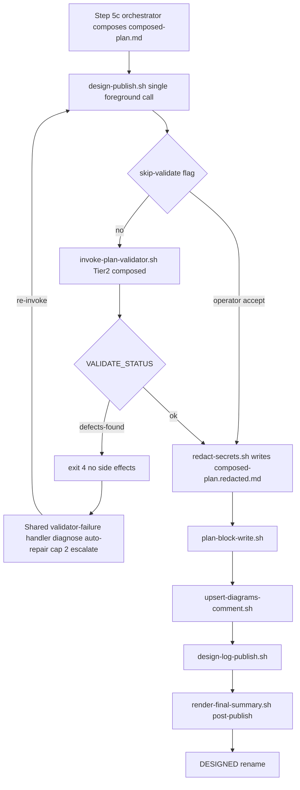

## Architecture Diagram

```mermaid
flowchart TD
    A[Step 5c orchestrator composes composed-plan.md] --> B[design-publish.sh single foreground call]
    B --> C{skip-validate flag}
    C -->|no| D[invoke-plan-validator.sh Tier2 composed]
    C -->|operator accept| F[redact-secrets.sh writes composed-plan.redacted.md]
    D --> E{VALIDATE_STATUS}
    E -->|defects-found| G[exit 4 no side effects]
    E -->|ok| F
    G --> H[Shared validator-failure handler diagnose auto-repair cap 2 escalate]
    H -->|re-invoke| B
    F --> I[plan-block-write.sh]
    I --> J[upsert-diagrams-comment.sh]
    J --> K[design-log-publish.sh]
    K --> L[render-final-summary.sh post-publish]
    L --> M[DESIGNED rename]
```
