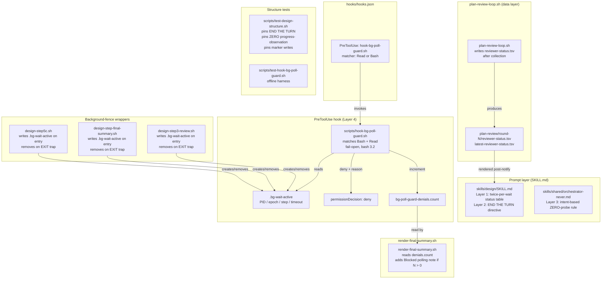

## Architecture Diagram

```mermaid
graph TD
    subgraph Prompt["Prompt layer (SKILL.md)"]
        SKILL["skills/design/SKILL.md<br/>Layer 1: twice-per-wait status table<br/>Layer 2: END THE TURN directive"]
        NEVER["skills/shared/orchestrator-never.md<br/>Layer 3: intent-based ZERO-probe rule"]
    end

    subgraph Wrappers["Background-fence wrappers"]
        W1["design-step3-review.sh<br/>writes .bg-wait-active on entry<br/>removes on EXIT trap"]
        W2["design-step-final-summary.sh<br/>writes .bg-wait-active on entry<br/>removes on EXIT trap"]
        W3["design-step5c.sh<br/>writes .bg-wait-active on entry<br/>removes on EXIT trap"]
    end

    subgraph Hook["PreToolUse hook (Layer 4)"]
        HOOK["scripts/hook-bg-poll-guard.sh<br/>matches Bash + Read<br/>fail-open, bash 3.2"]
        MARKER[".bg-wait-active<br/>PID / epoch / step / timeout"]
        HOOK -- "reads" --> MARKER
        HOOK -- "deny + reason" --> RESULT["permissionDecision: deny"]
        HOOK -- "increment" --> COUNT["bg-poll-guard-denials.count"]
    end

    subgraph Registration["hooks/hooks.json"]
        HOOKSREG["PreToolUse: hook-bg-poll-guard.sh<br/>matcher: Read or Bash"]
    end

    subgraph Driver["plan-review-loop.sh (data layer)"]
        LOOP["plan-review-loop.sh<br/>writes reviewer-status.tsv<br/>after collection"]
        TSV["plan-review/round-N/reviewer-status.tsv<br/>latest-reviewer-status.tsv"]
        LOOP -- "produces" --> TSV
    end

    subgraph Summary["render-final-summary.sh"]
        RENDER["render-final-summary.sh<br/>reads denials.count<br/>adds Blocked polling note if N > 0"]
    end

    subgraph CI["Structure tests"]
        STRUCT["scripts/test-design-structure.sh<br/>pins END THE TURN<br/>pins ZERO progress-observation<br/>pins marker writes"]
        HARNESS["scripts/test-hook-bg-poll-guard.sh<br/>offline harness"]
    end

    W1 -- "creates/removes" --> MARKER
    W2 -- "creates/removes" --> MARKER
    W3 -- "creates/removes" --> MARKER
    HOOKSREG -- "invokes" --> HOOK
    COUNT -- "read by" --> RENDER
    TSV -- "rendered post-notify" --> SKILL
```
