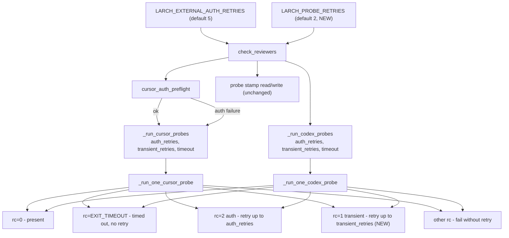

## Architecture Diagram

```mermaid
graph TD
    ENV1["LARCH_EXTERNAL_AUTH_RETRIES (default 5)"]
    ENV2["LARCH_PROBE_RETRIES (default 2, NEW)"]
    CR["check_reviewers"]
    PF["cursor_auth_preflight"]
    CP["_run_cursor_probes<br/>auth_retries, transient_retries, timeout"]
    DP["_run_codex_probes<br/>auth_retries, transient_retries, timeout"]
    OC["_run_one_cursor_probe"]
    OD["_run_one_codex_probe"]
    R0["rc=0 - present"]
    RT["rc=EXIT_TIMEOUT - timed out, no retry"]
    RA["rc=2 auth - retry up to auth_retries"]
    R1["rc=1 transient - retry up to transient_retries (NEW)"]
    RX["other rc - fail without retry"]
    STAMP["probe stamp read/write (unchanged)"]

    ENV1 --> CR
    ENV2 --> CR
    CR --> STAMP
    CR --> PF
    PF -->|"ok"| CP
    PF -->|"auth failure"| CP
    CR --> DP
    CP --> OC
    DP --> OD
    OC --> R0
    OC --> RT
    OC --> RA
    OC --> R1
    OC --> RX
    OD --> R0
    OD --> RT
    OD --> RA
    OD --> R1
    OD --> RX
```
