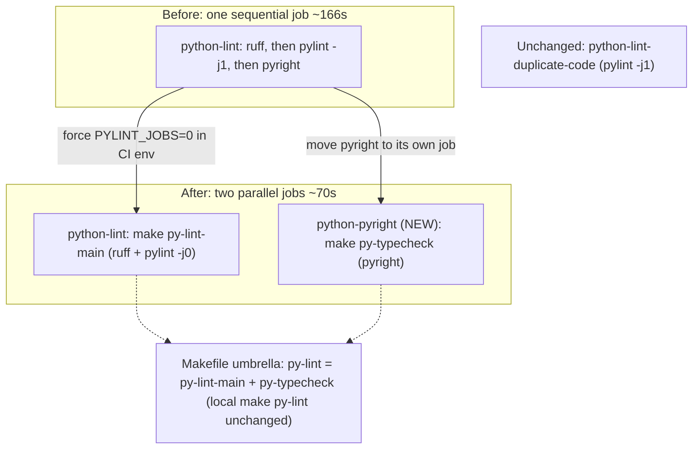

## Architecture Diagram

```mermaid
graph TD
    subgraph Before["Before: one sequential job ~166s"]
        B1["python-lint: ruff, then pylint -j1, then pyright"]
    end

    subgraph After["After: two parallel jobs ~70s"]
        A1["python-lint: make py-lint-main (ruff + pylint -j0)"]
        A2["python-pyright (NEW): make py-typecheck (pyright)"]
    end

    B1 -->|"force PYLINT_JOBS=0 in CI env"| A1
    B1 -->|"move pyright to its own job"| A2

    MK["Makefile umbrella: py-lint = py-lint-main + py-typecheck (local make py-lint unchanged)"]
    A1 -.-> MK
    A2 -.-> MK

    UNCHANGED["Unchanged: python-lint-duplicate-code (pylint -j1)"]
```
