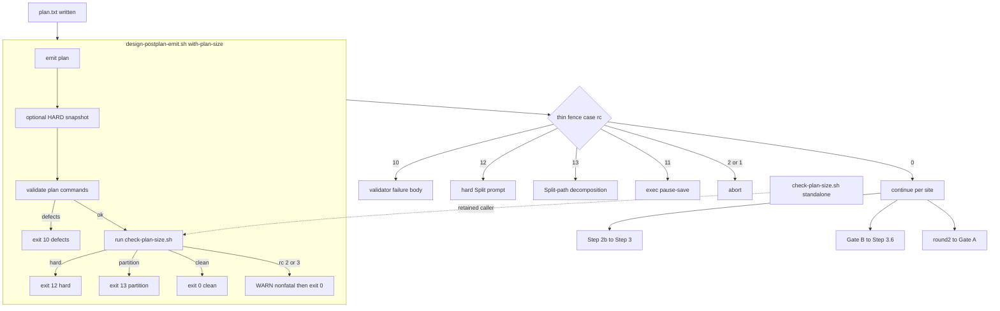

## Architecture Diagram

```mermaid
graph TD
    PLAN[plan.txt written] --> DRIVER

    subgraph DRIVER[design-postplan-emit.sh with-plan-size]
        EMIT[emit plan] --> SNAP[optional HARD snapshot]
        SNAP --> VAL[validate plan commands]
        VAL -->|defects| X10[exit 10 defects]
        VAL -->|ok| CPS[run check-plan-size.sh]
        CPS -->|hard| X12[exit 12 hard]
        CPS -->|partition| X13[exit 13 partition]
        CPS -->|clean| X0[exit 0 clean]
        CPS -->|rc 2 or 3| XW[WARN nonfatal then exit 0]
    end

    STD[check-plan-size.sh standalone] -.retained caller.-> CPS

    DRIVER --> DISP{thin fence case rc}
    DISP -->|0| NEXT[continue per site]
    DISP -->|10| VB[validator failure body]
    DISP -->|12| HP[hard Split prompt]
    DISP -->|13| SP[Split-path decomposition]
    DISP -->|11| PSV[exec pause-save]
    DISP -->|2 or 1| AB[abort]

    NEXT --> S2B[Step 2b to Step 3]
    NEXT --> GB[Gate B to Step 3.6]
    NEXT --> RD2[round2 to Gate A]
```
