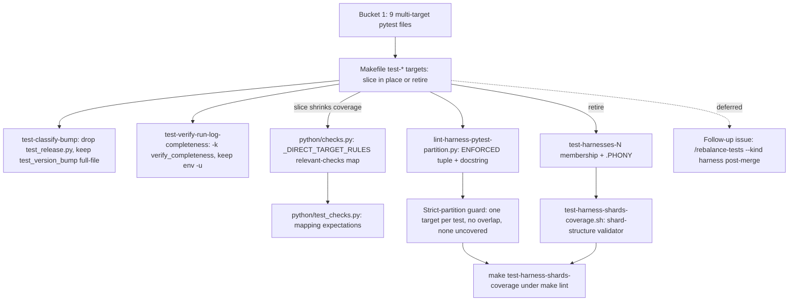

## Architecture Diagram

```mermaid
graph TD
    Bucket1["Bucket 1: 9 multi-target pytest files"]
    Targets["Makefile test-* targets: slice in place or retire"]
    Classify["test-classify-bump: drop test_release.py, keep test_version_bump full-file"]
    Verify["test-verify-run-log-completeness: -k verify_completeness, keep env -u"]
    Shards["test-harnesses-N membership + .PHONY"]
    Checks["python/checks.py: _DIRECT_TARGET_RULES relevant-checks map"]
    ChecksTest["python/test_checks.py: mapping expectations"]
    Enforced["lint-harness-pytest-partition.py: ENFORCED tuple + docstring"]
    Guard["Strict-partition guard: one target per test, no overlap, none uncovered"]
    Coverage["test-harness-shards-coverage.sh: shard-structure validator"]
    Lint["make test-harness-shards-coverage under make lint"]
    Followup["Follow-up issue: /rebalance-tests --kind harness post-merge"]

    Bucket1 --> Targets
    Targets --> Classify
    Targets --> Verify
    Targets -->|retire| Shards
    Targets -->|slice shrinks coverage| Checks
    Checks --> ChecksTest
    Targets --> Enforced
    Enforced --> Guard
    Shards --> Coverage
    Guard --> Lint
    Coverage --> Lint
    Targets -.->|deferred| Followup
```
