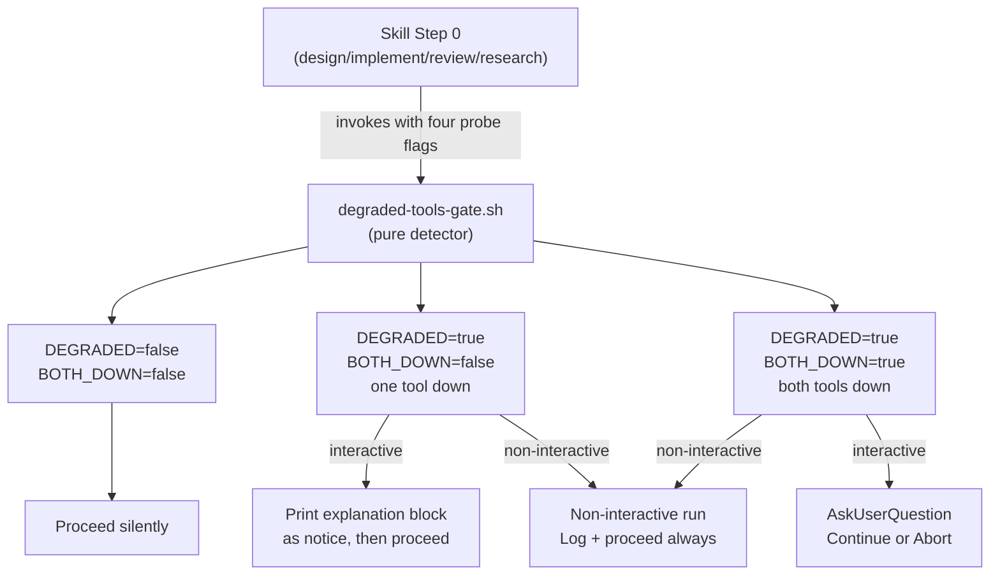

## Architecture Diagram

```mermaid
flowchart TD
    Session["Skill Step 0\n(design/implement/review/research)"]
    Gate["degraded-tools-gate.sh\n(pure detector)"]
    Out1["DEGRADED=false\nBOTH_DOWN=false"]
    Out2["DEGRADED=true\nBOTH_DOWN=false\none tool down"]
    Out3["DEGRADED=true\nBOTH_DOWN=true\nboth tools down"]
    Proceed["Proceed silently"]
    Warn["Print explanation block\nas notice, then proceed"]
    Ask["AskUserQuestion\nContinue or Abort"]
    NonInteractive["Non-interactive run\nLog + proceed always"]

    Session -->|"invokes with four probe flags"| Gate
    Gate --> Out1
    Gate --> Out2
    Gate --> Out3
    Out1 --> Proceed
    Out2 -->|"interactive"| Warn
    Out2 -->|"non-interactive"| NonInteractive
    Out3 -->|"interactive"| Ask
    Out3 -->|"non-interactive"| NonInteractive
```
