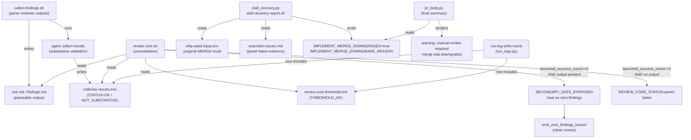

## Architecture Diagram

```mermaid
flowchart TD
    CF["collect-findings.sh\n(parse reviewer outputs)"] -->|writes| OM["oos.md / findings.md\n(parseable output)"]
    CF -->|runs| AC["agent collect-results\n(substantive validation)"]
    AC -->|writes| CR["collector-results.env\n(STATUS=OK / NOT_SUBSTANTIVE)"]

    RC["review-core.sh\n(consolidation)"] -->|reads| CR
    RC -->|reads| TH["review-core-threshold.env\n(THRESHOLD_OK)"]
    RC -->|reads| OM

    RC -->|launched_success_count==0\nAND output present| BYPASS["SECONDARY_GATE_BYPASSED\ntreat as zero-findings"]
    RC -->|launched_success_count==0\nAND no output| PF["REVIEW_CORE_STATUS=panel-failed"]
    BYPASS --> ZF["emit_zero_findings_branch\n(clean review)"]

    WR["run-log write-round\n(run_logs.py)"] -->|now includes| CR
    WR -->|now includes| TH

    SR["stall_recovery.py\nstall-recovery-report.sh"] -->|reads| SEED["ship-seed-input.env\n(original MERGE=true)"]
    SR -->|reads| EI["execution-issues.md\n(panel-failed evidence)"]
    SR -->|emits| DK["IMPLEMENT_MERGE_DOWNGRADED=true\nIMPLEMENT_MERGE_DOWNGRADE_REASON"]

    PB["pr_body.py\n(final summary)"] -->|reads| DK
    PB -->|renders| WARN["warning: manual review required\nmerge was downgraded"]
```
