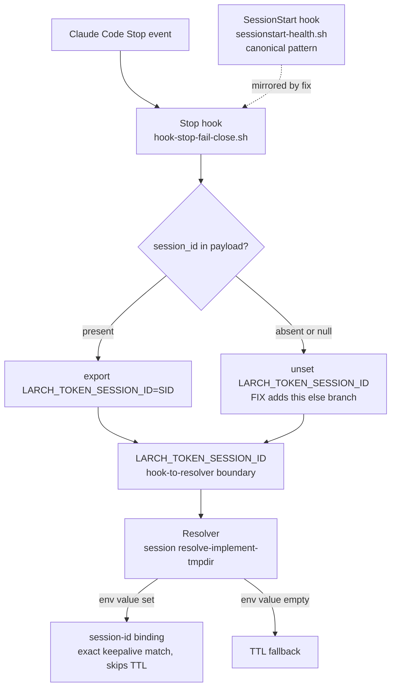

## Architecture Diagram

```mermaid
graph TD
    StopEvent["Claude Code Stop event"]
    Hook["Stop hook<br/>hook-stop-fail-close.sh"]
    Decision{"session_id in payload?"}
    Export["export LARCH_TOKEN_SESSION_ID=SID"]
    Unset["unset LARCH_TOKEN_SESSION_ID<br/>FIX adds this else branch"]
    EnvVar["LARCH_TOKEN_SESSION_ID<br/>hook-to-resolver boundary"]
    Resolver["Resolver<br/>session resolve-implement-tmpdir"]
    Bind["session-id binding<br/>exact keepalive match, skips TTL"]
    TTL["TTL fallback"]
    Ref["SessionStart hook<br/>sessionstart-health.sh<br/>canonical pattern"]

    StopEvent --> Hook
    Hook --> Decision
    Decision -->|present| Export
    Decision -->|absent or null| Unset
    Export --> EnvVar
    Unset --> EnvVar
    EnvVar --> Resolver
    Resolver -->|env value set| Bind
    Resolver -->|env value empty| TTL
    Ref -.->|mirrored by fix| Hook
```
