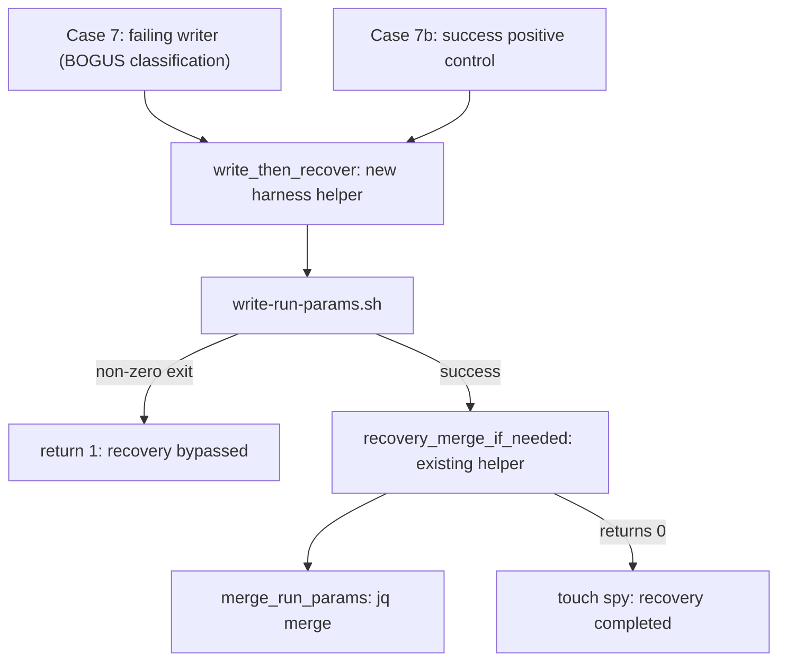

## Architecture Diagram

```mermaid
graph TD
    C7["Case 7: failing writer (BOGUS classification)"]
    C7B["Case 7b: success positive control"]
    WTR["write_then_recover: new harness helper"]
    WRITER["write-run-params.sh"]
    ABORT["return 1: recovery bypassed"]
    REC["recovery_merge_if_needed: existing helper"]
    MERGE["merge_run_params: jq merge"]
    SPY["touch spy: recovery completed"]

    C7 --> WTR
    C7B --> WTR
    WTR --> WRITER
    WRITER -->|non-zero exit| ABORT
    WRITER -->|success| REC
    REC --> MERGE
    REC -->|returns 0| SPY
```
