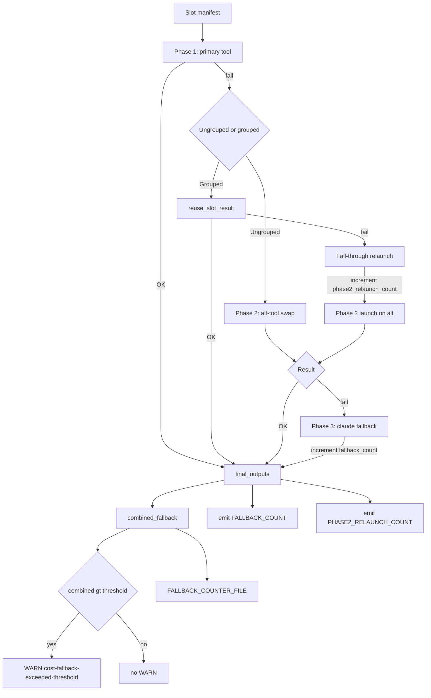

## Architecture Diagram

```mermaid
flowchart TD
    A[Slot manifest] --> B[Phase 1: primary tool]
    B -->|OK| Z[final_outputs]
    B -->|fail| C{Ungrouped or grouped}
    C -->|Ungrouped| D[Phase 2: alt-tool swap]
    C -->|Grouped| E[reuse_slot_result]
    E -->|OK| Z
    E -->|fail| F[Fall-through relaunch]
    F -->|increment phase2_relaunch_count| G[Phase 2 launch on alt]
    D --> H{Result}
    G --> H
    H -->|OK| Z
    H -->|fail| I[Phase 3: claude fallback]
    I -->|increment fallback_count| Z
    Z --> J[combined_fallback]
    J --> K{combined gt threshold}
    K -->|yes| L[WARN cost-fallback-exceeded-threshold]
    K -->|no| M[no WARN]
    J --> N[FALLBACK_COUNTER_FILE]
    Z --> O[emit FALLBACK_COUNT]
    Z --> P[emit PHASE2_RELAUNCH_COUNT]
```
