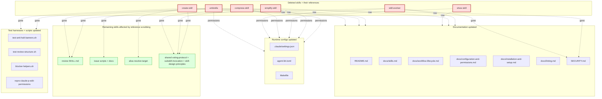

## Architecture Diagram

```mermaid
graph TD
  subgraph DELETED[Deleted skills + their references]
    SE[skill-evolver]
    SI[simplify-skill]
    SH[show-skill]
    CO[compress-skill]
    CR[create-skill]
    UM[umbrella]
  end

  subgraph KEEP[Remaining skills affected by reference scrubbing]
    REV[review SKILL.md]
    ISS[issue scripts + docs]
    ALI[alias resolve-target]
    SHARED[shared voting-protocol + subskill-invocation + skill-design-principles]
  end

  subgraph CONFIG[Runtime configs updated]
    SET[.claude/settings.json]
    LINT[agent-lint.toml]
    MK[Makefile]
  end

  subgraph DOCS[Documentation updated]
    RD[README.md]
    DSK[docs/skills.md]
    DWL[docs/workflow-lifecycle.md]
    DCP[docs/configuration-and-permissions.md]
    DIS[docs/installation-and-setup.md]
    DL[docs/linting.md]
    SEC[SECURITY.md]
  end

  subgraph SCRIPTS[Test harnesses + scripts updated]
    AH[test-anti-halt-banners.sh]
    RVS[test-review-structure.sh]
    BH[blocker-helpers.sh]
    RP[repro-claude-p-edit-permissions]
  end

  SE -.gone.-> REV
  UM -.gone.-> REV
  UM -.gone.-> ISS
  CR -.gone.-> ALI
  CR -.gone.-> SHARED
  SI -.gone.-> SHARED
  CO -.gone.-> SHARED
  UM -.gone.-> SEC
  SE -.gone.-> SEC
  UM -.gone.-> SCRIPTS
  CR -.gone.-> SCRIPTS

  CR -.permissions.-> CONFIG
  SI -.permissions.-> CONFIG
  SH -.permissions.-> CONFIG
  CO -.permissions.-> CONFIG
  SE -.permissions.-> CONFIG
  UM -.permissions.-> CONFIG

  SE -.row.-> DOCS
  SI -.row.-> DOCS
  SH -.row.-> DOCS
  CO -.row.-> DOCS
  CR -.row.-> DOCS
  UM -.row.-> DOCS

  classDef deleted fill:#fdd,stroke:#900,stroke-width:2px
  classDef keep fill:#dfd,stroke:#090,stroke-width:1px
  class SE,SI,SH,CO,CR,UM deleted
  class REV,ISS,ALI,SHARED keep
```
