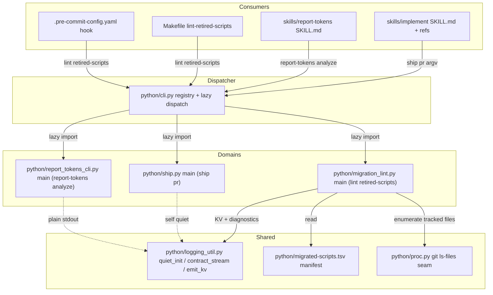

## Architecture Diagram

```mermaid
graph TD
  subgraph Consumers
    IMPL["skills/implement SKILL.md + refs"]
    RT["skills/report-tokens SKILL.md"]
    MK["Makefile lint-retired-scripts"]
    PC[".pre-commit-config.yaml hook"]
  end

  subgraph Dispatcher
    CLI["python/cli.py registry + lazy dispatch"]
  end

  subgraph Domains
    SHIP["python/ship.py main (ship pr)"]
    RTC["python/report_tokens_cli.py main (report-tokens analyze)"]
    LINT["python/migration_lint.py main (lint retired-scripts)"]
  end

  subgraph Shared
    LOG["python/logging_util.py quiet_init / contract_stream / emit_kv"]
    MAN["python/migrated-scripts.tsv manifest"]
    PROC["python/proc.py git ls-files seam"]
  end

  IMPL -->|ship pr argv| CLI
  RT -->|report-tokens analyze| CLI
  MK -->|lint retired-scripts| CLI
  PC -->|lint retired-scripts| CLI

  CLI -->|lazy import| SHIP
  CLI -->|lazy import| RTC
  CLI -->|lazy import| LINT

  LINT -->|read| MAN
  LINT -->|enumerate tracked files| PROC
  LINT -->|KV + diagnostics| LOG
  SHIP -.self quiet.-> LOG
  RTC -.plain stdout.-> LOG
```
