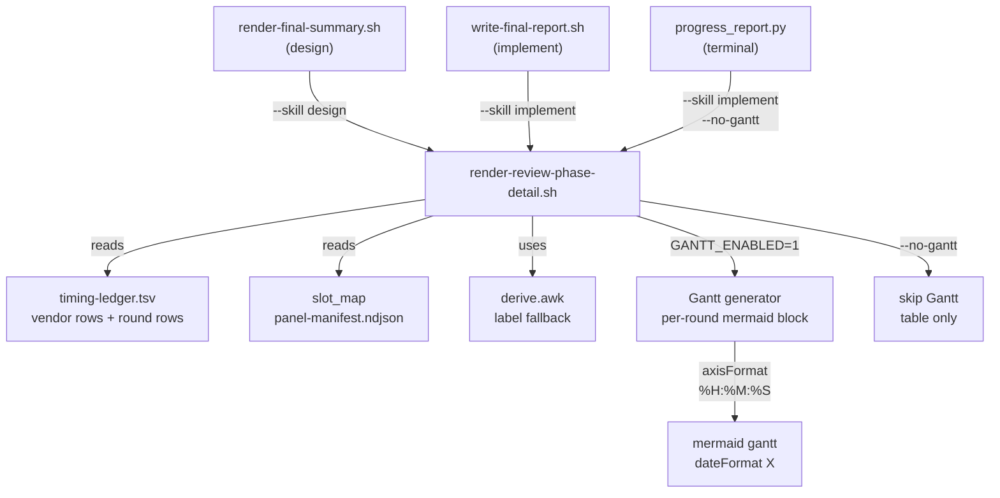

## Architecture Diagram

```mermaid
flowchart TD
    FS["render-final-summary.sh\n(design)"] -->|--skill design| RPD
    WFR["write-final-report.sh\n(implement)"] -->|--skill implement| RPD
    PR["progress_report.py\n(terminal)"] -->|--skill implement\n--no-gantt| RPD

    RPD["render-review-phase-detail.sh"]
    TL["timing-ledger.tsv\nvendor rows + round rows"]
    SM["slot_map\npanel-manifest.ndjson"]
    DA["derive.awk\nlabel fallback"]

    RPD -->|reads| TL
    RPD -->|reads| SM
    RPD -->|uses| DA

    RPD -->|GANTT_ENABLED=1| GEN["Gantt generator\nper-round mermaid block"]
    RPD -->|--no-gantt| SKIP["skip Gantt\ntable only"]

    GEN -->|axisFormat\n%H:%M:%S| MD["mermaid gantt\ndateFormat X"]
```
