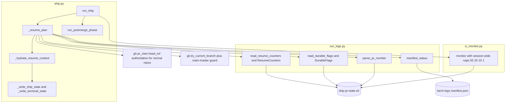

## Architecture Diagram

```mermaid
graph TD
    subgraph ship_py[ship.py]
        RS[run_ship]
        RP[_resume_plan]
        HY[_hydrate_resume_context]
        WS[_write_ship_state and _write_terminal_state]
        PM[run_postmerge_phase]
    end
    subgraph run_logs_py[run_logs.py]
        RC[read_resume_counters and ResumeCounters]
        DF[read_durable_flags and DurableFlags]
        PP[parse_pr_number]
        MS[manifest_status]
    end
    subgraph ci_monitor_py[ci_monitor.py]
        MON[monitor with session-wide caps 50 20 10 1]
    end
    GH[gh.pr_view head_ref authoritative for normal repos]
    GIT[git.try_current_branch plus main-master guard]
    STATE[(ship-pr-state.sh)]
    MANIFEST[(larch-logs manifest.json)]

    RS --> RP
    RP --> RC
    RP --> DF
    RP --> PP
    RP --> MS
    RP --> GH
    RP --> GIT
    RC --> STATE
    DF --> STATE
    PP --> STATE
    MS --> MANIFEST
    RP --> HY
    HY --> WS
    RS --> MON
    RS --> PM
    MON --> STATE
```
