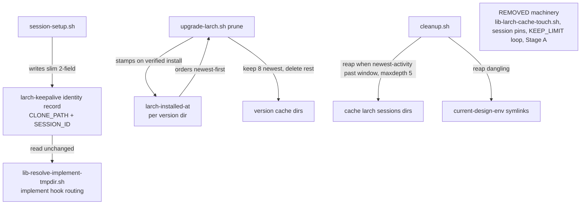

## Architecture Diagram

```mermaid
graph TD
    SS["session-setup.sh"]
    ID["larch-keepalive identity record<br/>CLONE_PATH + SESSION_ID"]
    RES["lib-resolve-implement-tmpdir.sh<br/>implement hook routing"]
    UL["upgrade-larch.sh prune"]
    STAMP["larch-installed-at<br/>per version dir"]
    VER["version cache dirs"]
    CL["cleanup.sh"]
    SESS["cache larch sessions dirs"]
    SYM["current-design-env symlinks"]

    SS -->|writes slim 2-field| ID
    ID -->|read unchanged| RES
    UL -->|stamps on verified install| STAMP
    STAMP -->|orders newest-first| UL
    UL -->|keep 8 newest, delete rest| VER
    CL -->|reap when newest-activity past window, maxdepth 5| SESS
    CL -->|reap dangling| SYM

    REMOVED["REMOVED machinery<br/>lib-larch-cache-touch.sh, session pins, KEEP_LIMIT loop, Stage A"]
```
