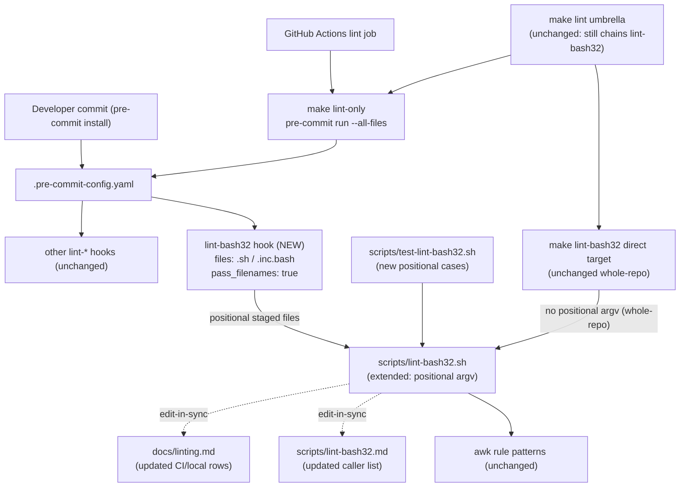

## Architecture Diagram

```mermaid
flowchart TD
    DEV["Developer commit (pre-commit install)"]
    PRECOMMIT[".pre-commit-config.yaml"]
    HOOK_NEW["lint-bash32 hook (NEW)<br/>files: .sh / .inc.bash<br/>pass_filenames: true"]
    HOOK_OTHERS["other lint-* hooks (unchanged)"]
    LINT["scripts/lint-bash32.sh<br/>(extended: positional argv)"]
    AWK["awk rule patterns (unchanged)"]
    HARNESS["scripts/test-lint-bash32.sh<br/>(new positional cases)"]
    MAKE_LINT["make lint umbrella<br/>(unchanged: still chains lint-bash32)"]
    MAKE_LB["make lint-bash32 direct target<br/>(unchanged whole-repo)"]
    LINT_ONLY["make lint-only<br/>pre-commit run --all-files"]
    CI["GitHub Actions lint job"]
    DOCS["docs/linting.md<br/>(updated CI/local rows)"]
    MD["scripts/lint-bash32.md<br/>(updated caller list)"]

    DEV --> PRECOMMIT
    PRECOMMIT --> HOOK_NEW
    PRECOMMIT --> HOOK_OTHERS
    HOOK_NEW -- "positional staged files" --> LINT
    MAKE_LB -- "no positional argv (whole-repo)" --> LINT
    MAKE_LINT --> MAKE_LB
    MAKE_LINT --> LINT_ONLY
    LINT_ONLY --> PRECOMMIT
    CI --> LINT_ONLY
    LINT --> AWK
    HARNESS --> LINT
    LINT -. "edit-in-sync" .-> MD
    LINT -. "edit-in-sync" .-> DOCS
```
