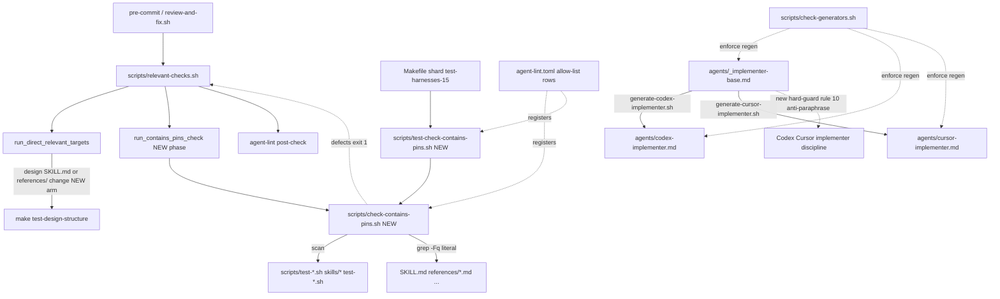

## Architecture Diagram

```mermaid
graph TD
    pre_commit[pre-commit / review-and-fix.sh] --> relevant_checks[scripts/relevant-checks.sh]

    relevant_checks --> route_direct[run_direct_relevant_targets]
    relevant_checks --> phase_pins[run_contains_pins_check NEW phase]
    relevant_checks --> agent_lint[agent-lint post-check]

    route_direct -->|design SKILL.md or references/ change NEW arm| test_design_structure[make test-design-structure]
    phase_pins --> check_contains_pins[scripts/check-contains-pins.sh NEW]

    check_contains_pins -->|scan| test_scripts[scripts/test-*.sh skills/* test-*.sh]
    check_contains_pins -->|grep -Fq literal| target_files[SKILL.md references/*.md ...]
    check_contains_pins -.->|defects exit 1| relevant_checks

    test_check_contains_pins[scripts/test-check-contains-pins.sh NEW] --> check_contains_pins
    makefile[Makefile shard test-harnesses-15] --> test_check_contains_pins
    agent_lint_toml[agent-lint.toml allow-list rows] -.->|registers| check_contains_pins
    agent_lint_toml -.->|registers| test_check_contains_pins

    implementer_base[agents/_implementer-base.md] -->|generate-codex-implementer.sh| codex_impl[agents/codex-implementer.md]
    implementer_base -->|generate-cursor-implementer.sh| cursor_impl[agents/cursor-implementer.md]
    implementer_base -.->|new hard-guard rule 10 anti-paraphrase| prompt_discipline[Codex Cursor implementer discipline]

    check_generators[scripts/check-generators.sh] -.->|enforce regen| implementer_base
    check_generators -.->|enforce regen| codex_impl
    check_generators -.->|enforce regen| cursor_impl
```
