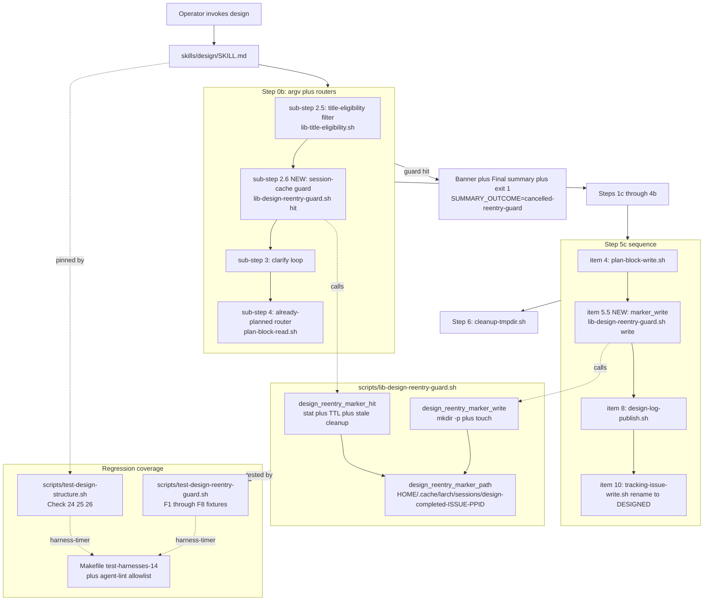

## Architecture Diagram

```mermaid
flowchart TD
    OP[Operator invokes design] --> SKILL[skills/design/SKILL.md]

    subgraph Step0b [Step 0b: argv plus routers]
        SS25[sub-step 2.5: title-eligibility filter<br/>lib-title-eligibility.sh]
        SS26[sub-step 2.6 NEW: session-cache guard<br/>lib-design-reentry-guard.sh hit]
        SS3[sub-step 3: clarify loop]
        SS4[sub-step 4: already-planned router<br/>plan-block-read.sh]
        SS25 --> SS26 --> SS3 --> SS4
    end

    SKILL --> Step0b
    Step0b -->|fresh| Step1to4[Steps 1c through 4b]
    Step0b -->|guard hit| BAIL[Banner plus Final summary plus exit 1<br/>SUMMARY_OUTCOME=cancelled-reentry-guard]

    Step1to4 --> Step5c[Step 5c: write larch:plan plus publish plus rename]

    subgraph Step5c [Step 5c sequence]
        S5_4[item 4: plan-block-write.sh]
        S5_55[item 5.5 NEW: marker_write<br/>lib-design-reentry-guard.sh write]
        S5_8[item 8: design-log-publish.sh]
        S5_10[item 10: tracking-issue-write.sh rename to DESIGNED]
        S5_4 --> S5_55 --> S5_8 --> S5_10
    end

    Step5c --> Step6[Step 6: cleanup-tmpdir.sh]

    subgraph Helper [scripts/lib-design-reentry-guard.sh]
        MW[design_reentry_marker_write<br/>mkdir -p plus touch]
        MH[design_reentry_marker_hit<br/>stat plus TTL plus stale cleanup]
        MP[design_reentry_marker_path<br/>HOME/.cache/larch/sessions/design-completed-ISSUE-PPID]
        MW --> MP
        MH --> MP
    end

    SS26 -.calls.-> MH
    S5_55 -.calls.-> MW

    subgraph Tests [Regression coverage]
        T1[scripts/test-design-reentry-guard.sh<br/>F1 through F8 fixtures]
        T2[scripts/test-design-structure.sh<br/>Check 24 25 26]
        T3[Makefile test-harnesses-14<br/>plus agent-lint allowlist]
        T1 -.harness-timer.-> T3
        T2 -.harness-timer.-> T3
    end

    Helper -.tested by.-> T1
    SKILL -.pinned by.-> T2
```
