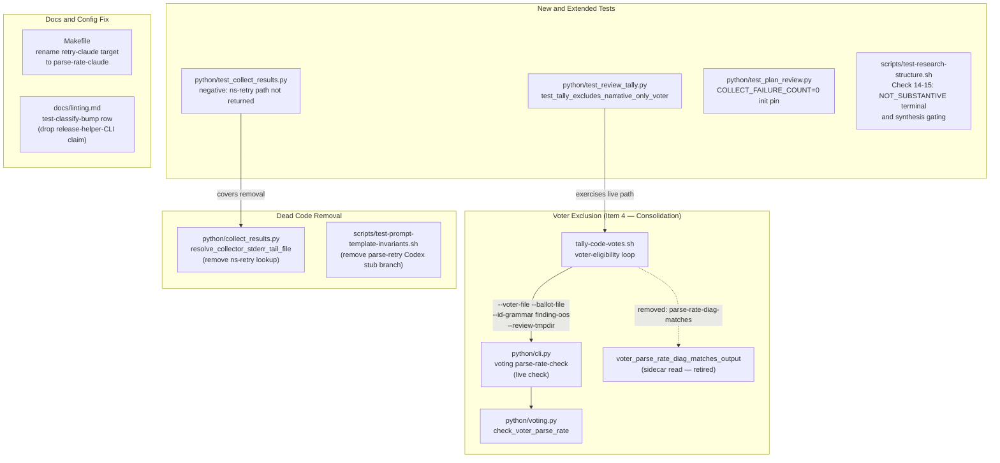

## Architecture Diagram

```mermaid
graph TD
    subgraph VoterExclusion["Voter Exclusion (Item 4 — Consolidation)"]
        TCVsh["tally-code-votes.sh\nvoter-eligibility loop"]
        PRC["python/cli.py\nvoting parse-rate-check\n(live check)"]
        VPY["python/voting.py\ncheck_voter_parse_rate"]
        PDMO["voter_parse_rate_diag_matches_output\n(sidecar read — retired)"]
        TCVsh -->|"--voter-file --ballot-file\n--id-grammar finding-oos\n--review-tmpdir"| PRC
        PRC --> VPY
        TCVsh -. "removed: parse-rate-diag-matches" .-> PDMO
    end

    subgraph Tests["New and Extended Tests"]
        TRT["python/test_review_tally.py\ntest_tally_excludes_narrative_only_voter"]
        TCRT["python/test_collect_results.py\nnegative: ns-retry path not returned"]
        TPRY["python/test_plan_review.py\nCOLLECT_FAILURE_COUNT=0 init pin"]
        TRS["scripts/test-research-structure.sh\nCheck 14-15: NOT_SUBSTANTIVE terminal\nand synthesis gating"]
    end

    subgraph DeadCodeRemoval["Dead Code Removal"]
        CRP["python/collect_results.py\nresolve_collector_stderr_tail_file\n(remove ns-retry lookup)"]
        TPTI["scripts/test-prompt-template-invariants.sh\n(remove parse-retry Codex stub branch)"]
    end

    subgraph DocFix["Docs and Config Fix"]
        MK["Makefile\nrename retry-claude target\nto parse-rate-claude"]
        DL["docs/linting.md\ntest-classify-bump row\n(drop release-helper-CLI claim)"]
    end

    TRT -->|"exercises live path"| TCVsh
    TCRT -->|"covers removal"| CRP
```
